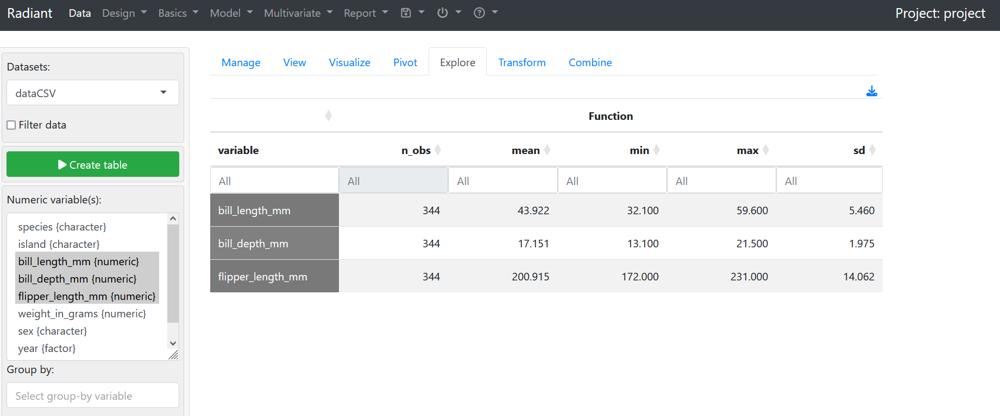
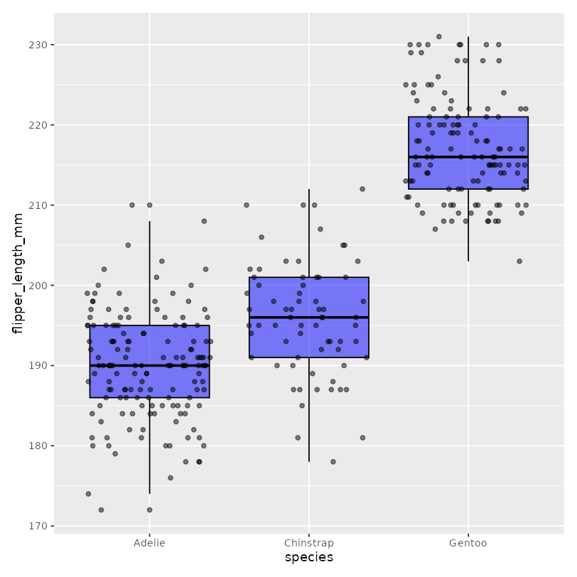

## Basic Functionalities
### 1. Importing Data from Local Machine into PosIt Cloud/RStudio
*Step 1:* Add file from local machine using the `Upload` menu in the Bottom-Right pane.

*Step 2:* Select / Click on the target file > `Import` dataset

> **Important Note:** Have to load the files in before starting radiant to be able to access them.
## 2. Starting Radiant in a new tab
In the second most upper toolbar, **select Addins > Start radiant (browser)** to launch the application. Click `Retry` for any browser pop-up configuration issues.

Under **Data > Manage**, we can load the dataset files from the working directory into the radiant application itself.

## 3. Good Practice 1: Terminating Radiant before Exit
We can do so by:
- using the terminate button in the menu
	
- using the terminate button within the app itself
	

---
## Radiant Features
### 1. Dataset toggle button and default datasets (as displayed below)

### 2. Data Summary selector

In the summary tab, we can view the numerical and categorical data points. The categorical data points are known as vectors in R / Radiant.

	
### 3. Transforming incorrectly tagged columns
#### Part 1 - Transforming the year
- *Step 1:* Identify the column in the data summary pane.
	

- *Step 2/3:* Use the `Transform` tab
	- Select the column itself > set **Transformation Type as `Change Type`** > set **Change Variable Type to `As factor`**.
		
		

- *Step 4:* Click `Store` to "save changes".

	

- *Step 5:* View and verify updated changes in the `Manage` tab.
	

#### Part 2 - Correcting the factors/categorical variables
- notice based on the above that there is a separate block for character variables
- we can use `Transform` tab and play with `Transformation type` and `variable type` to ensure that our columns are properly understood by radiant (of categorical values)

### 4. Creating a new column in the dataset
- Use the `transform` tab as per usual.
	

- Verify the results again in the `manage` tab.
	

### 5. Explore data, filtering and summary statistics

- can use this tab to work with some of the summary statistics for our dataset.
- workflow:
	- select columns we want to calculate statistics for (with **`Ctrl + click`**) -> note: should only select numerical columns as categorical values are not displayed.
	- click `Create table`.
	

- can also modify types of summary statistics "functions" displayed.
	

- conditional operators on dataset -> use of the `Group by` filter (can do by more than one categorical variable).
	

### 6. Visualizing the data through charts and graphs

Use the `Visualize` tab under Data. And use `Distribution` for bar chart.

Modify the `fill` parameter to show flipper length by island based on the dataset.

We can also transform this into a box-plot by changing the `plot-type`. -> must have at least a y-variable.
- x-variable: `species`
- y-variable: `flipper_length_mm`
- jitter enabled

	
	