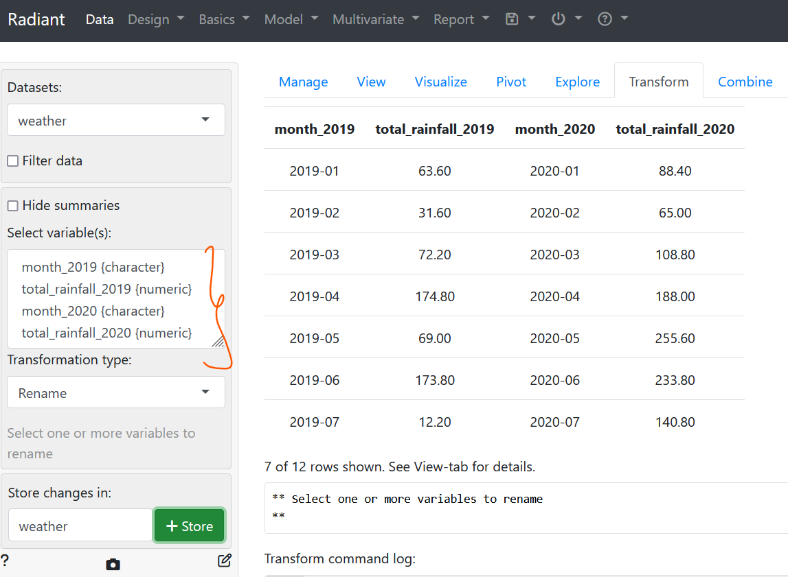

## Using Radiant

### Importing and formatting data
1. Import the data `weather.csv` as described in Lab 0 and proceed to the `View` tab.
	1. We can notice that columns 1 and 3 have the same name (i.e. `month` with a number suffix) and so does columns 2 and 4
	

2. We can get rid of this feature using the `Transform` tab and renaming to columns to what we want (more descriptive)
	

### Visualizing the data using bar plots
For the initial bar plot, we choose the `y` as the total rainfall in 2020 and the `x` as the month in 2020. We want a `bar` plot-type so we specify as so as shown below.

To beautify the plot, we can change certain properties
- **style**: change height and width
- manipulating **color** and **opacity** to vary the style of the bars
- update **labels** to give a plot a name and modify the variable names displayed on the x and y axes

---
## Using Excel

Using excel to open `weather.csv`, **select only columns `C` and `D`**.

- click on `Insert` and select under 2-D column

