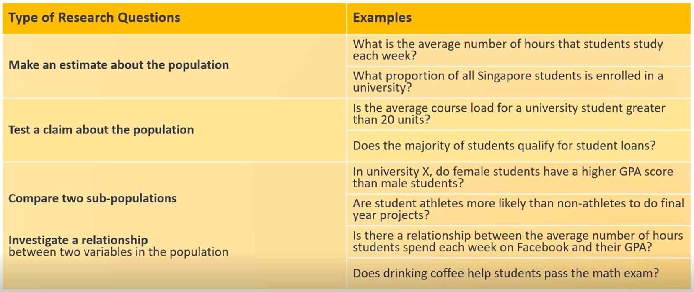
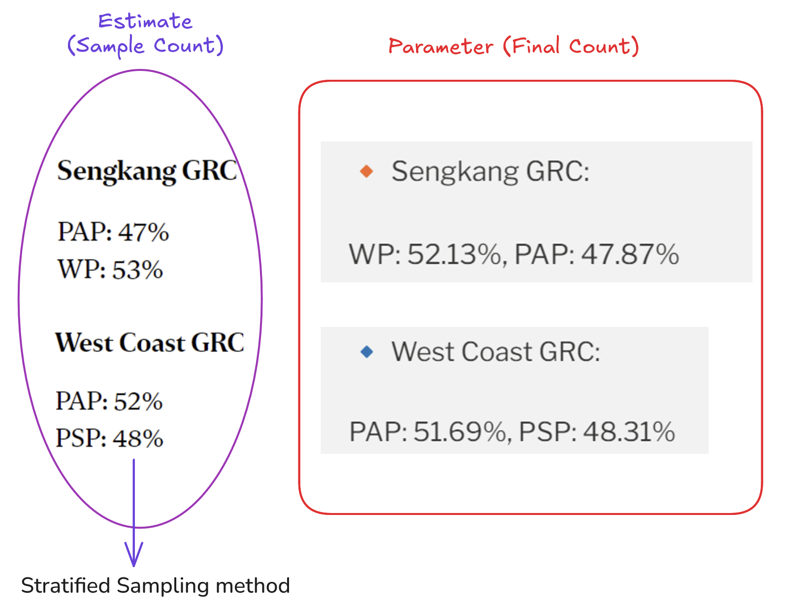
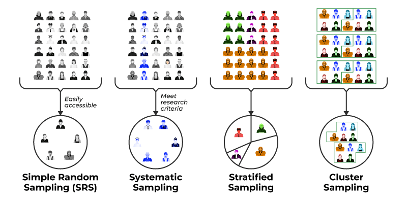
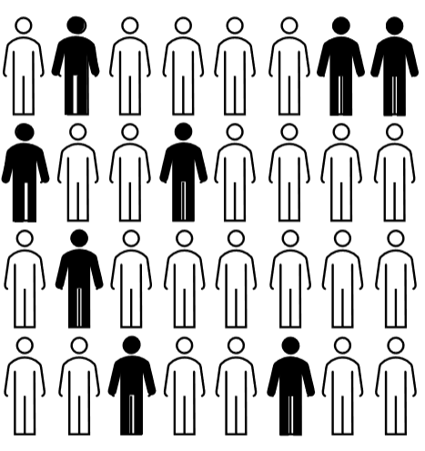
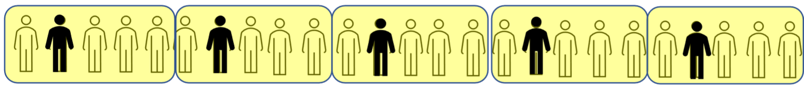
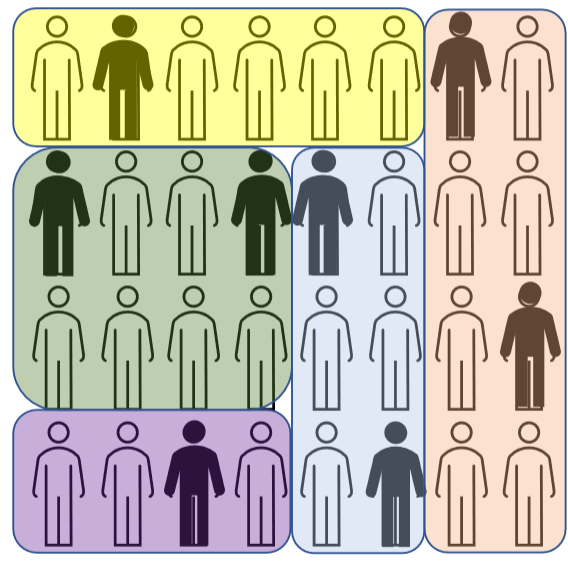
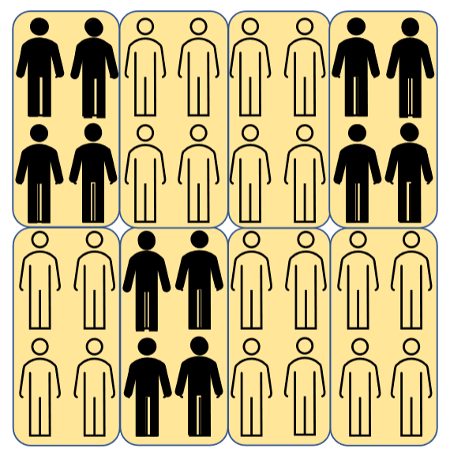

## A. Lesson Objectives and Key Terms
-  *Key terms:* population, sampling frame, census and sample

- differences in types of **sampling methods:**
	- probability sampling
	- non-probability sampling
	
- types of **variables**
	- numerical variables
	- categorical variables

- types of **summary statistics**
	- mean
	- median
	- mode
	- standard deviation / variance

- understand various criteria with regards to generalisability

---
## B. Motivations
- increasing trends of processes being data-driven
	- market trends
	- customer feedback
	- vaccine's effectiveness and its r/s to decrease in the number of marriages
### Key terms
1. **Population:** is the entire group (of individuals or objects) that we want to know something about.
2. **Research question**: question seeking to investigate some characteristic of a (target) population
	1. Examples
		1. What % of SG adults own a car? *(population: S'pore adults)*
		2. Does Brand XYZ pesticide work against mosquitoes in Malaysia? *(population: mosquitoes in M'sia)*
		3. Do NUS students that take notes using pen and paper score better than those using laptops? *(population: all NUS students)*
	2. Types
		1. **Estimate** something about population - find things like `average (mean)` or `proportion`.
		2. **Test a claim / hypothesis** - also about an average value or a proportion with given characteristic.
		3. **Compare two sub-populations** or **Investigate a relationship btwn two variables within population** 

	3. Characteristics of a good research question:
		- specific, important and original (defined scope, aim to contribute original knowledge)

	
---
## C. Introduction to Sampling
### 1. Exploratory Data Analysis
- may have many possible independent variables (plotted on `x-axis`) which affect a certain dependent variable (plotted on the `y-axis`)
	- adopt a systematic technique of exploratory data analysis to explore raw data -> summarize findings using graphs and different numerical techniques
	- can be carried out on both categorical and numerical data

- Outcome of EDA: have a few useful questions answered

**Data-Cleaning**
1. Ambiguous data
2. Empty Cells
3. Contextually unsound (i.e. C+ as a blood type?)
4. Duplicated Labelling

*Steps for EDA*
1. Generate questions (or have a pre-determined question that we want answered by the data)
2. Visualization and analysis (using data modelling tools)
	1. using scatterplots, histograms, box plots etc.
3. Answer and Refine questions (or generate new ones)
	1. "To what extent does data help to answer our question(s)"  in Step 1?

### 2. Terminology
- **Population of interest**: group which researcher has interest in drawing conclusions (should be unambiguous to a certain extent).
	- **Population parameter**: numerical fact about the population surveyed (these are constants!)

- **Sample**: selection of a proportion of the population selected in the study
	- required when it is not ideal/feasible to collect data from all individuals in a population of interest OR census data is NOT readily available.
	- **Estimate**: inference based on information from the sample (thru data collection and analysis methods) / "empirical fact"
	
- **Sampling Frame**: source of the sample
	- hope that there is an overlap btwn target population and sampling frame -> ideally for it to be *exactly equal* or "generalisable" (i.e. `sampling frame ≥ target population`)
	- problems with sampling frame
		- insufficient coverage: outliers and edge cases (proportion should match and have no form of underrepresentation of members within the population)
		- there might be redundant data in the sample
	
- **Census**: can obtain data for all members of population, but in the bounds of the sampling frame
	- ***attempt*** to reach out to the whole population `≈ 100%` (may not achieve 100% response rate)

- **Statistic:** Inference about parameter from sample

#### Advantages of taking a sample
- less costly administratively
- data collection and processing is significantly faster compared to census data
### 3. Biases
A. Selection Bias
- **researcher's own** bias in selection of units
	- sampling frame might be imperfect (i.e. individuals are left out unintentionally)
- usage of **non-probability sampling**
	- does not involve use of chance in selection of candidates
	- skewed understanding of population parameter / facts due to unequal coverage

B. Non-response Bias
- non-disclosure of information by respondents
	- not interested in subject of study
	- responding might be inconvenient
	- (feel that) information is too sensitive to be disclosed -> embarrassing information
	
- may distort researcher's understanding of true population parameter

### 4. Probability Sampling
- sampling process via a known **randomised mechanism**
	- each unit has a **non-zero & known** (`≥ 0.0`) probability of being selected
- involves the use of "chance"
- probability of selection may not be the same throughout all units of the sampling frame itself
- the element of chance in this method helps to **eliminate biases** associated with selection

#### i. Simple Random Sampling (SRS)
- units are selected randomly from the sampling frame without replacement
	- use of a RNG/PRNG for selection
	- ==each set of units (or individuals) has an **EQUAL CHANCE** of getting selected==
- *application: random polls across population*

- Advantages
	- results don't change haphazardly btwn samples
	- **Good representation:** group selected (sampling frame) is quite small, but likely to be representative of the population
- Disadvantage
	- **Accessibility** of selected participants -> different geographical locations, thus time consuming
	- **Non-response** by selected participants -> skew results

#### ii. Systematic Sampling
- pick every `nth` person to sample from each "group" (have an interval) / apply a selection interval *`k`* and random starting point from the first interval.

- Advantage
	- Much **simpler** compared to SRS
	- **don't need** to know the exact population size at planning stage
- Disadvantage
	- Not a good representation of the population of interest (since not random); potentially underrepresents the population

### iii. Stratified Random Sampling
- Sampling frame is subdivided into sub-groups or strata of **different sizes**
	- units within stratas share similar characteristics (size of stratas might vary)
	- Simple random sampling is employed within stratums
- example: *sample count* within constituencies during elections

- Most important thing: ==Is there random selection involved?==

- Advantage
	- Good representation of sample by stratum
- Disadvantage
	- need information about the sampling frame and strata classification criterion
	

#### iv. Cluster Sampling
- units (population) are broken down into **similar** clusters
- randomly sample a fixed number of clusters
- include **all observations / all of the members** from selected classes as members of the sample 

- Advantages
	- Less tedious and time consuming compared to other sampling methods (often used when population is too large or there is a large geographical area that is required to sample)
	- Less costly
- Disadvantage
	- **High variability** for dissimilar clusters or if clusters are very small

*Compared to stratified sampling*
- members of clusters have different characteristics, while members of strata have similar characteristics.

### 5. Non-Probability Sampling
- doesn't involve the use of chance
- types of non-probabilistic methods (not mutually exclusive, i.e. `> 1` method can be used):
	- Convenience Sampling, Volunteer Sampling
	- Quota Sampling, Judgement Sampling (outside of course scope)

#### i. Convenience Sampling
- selection of subjects based on
	- proximity or,
	- availability, with respect to the researcher

- examples: mall surveys
	- Disadvantage: 
		- **selection bias** for those who frequent malls as opposed to those who don't go to malls -> **insufficient coverage** of certain demographics within population of interest, lack external validity
		- **non-response bias**
#### ii. Volunteer Sampling
- researchers actively seek volunteers' participation

- example: online polls
	- selection bias
	- non-response bias

### 6. Good Practices
1. Choosing an appropriate sampling frame -> ensure good coverage of target population
2. Use a probability sampling method -> reduce selection bias to a minimal
3. Remove unwanted units (from sampling frame)

### 7. Generalisability
Criteria for Generalisability (has be met to a reasonable degree $\to$ **all 4** should be met)
- **Good sampling frame** (larger than or equal to target population) $\implies$ members of target population must not be left out
- Use of ***probability-based sampling method*** $\implies$ minimize selection bias
- **Large sample size** $\implies$ reduce variability of data and amount of "error"
- **Minimum non-response proportion** (high response would be ~80%) $\implies$ ↑ non-response = ↓ generalisability

Purpose: want to achieve as accurate data collection as possible.

---
## D. Variables & Summary Statistics

### 1. Variables
Data Sets consists of individuals and variables/properties pertaining to those individuals.
- each row is a record (of an individual) and each column is a variable

> *def*: an attribute that can be measured or labelled
- examples: Race, Age, Population Density, SES, Time, Sex/gender

**Independent & Dependent Variables**
> Independent variable - might be subject to manipulation (i.e. *deliberately* by the researcher himself or *spontaneously* outside of the researcher's control)

> Dependent variable - variables hypothesized to change depending on how the independent variable is manipulated

#### Types of variables
1. Categorical Variables
	1. takes label values which are **mutually exclusive** (i.e. predominant colours of cars, no overlap)
	2. ***Ordinal*** categorical: Comes with ==ordering== that is usually represented using numbers (but CANNOT do arithmetic on data)
		- i.e. 1 - Strongly Disagree, 2 - Disagree, 3 - Neutral, 4 - Agree... etc.
		- number labelling doesn't transform categorical into numeric variables
	3. ***Nominal*** categorical: no intrinsic ordering of variables
	
2. Numerical Variables
	1. takes numerical values, allow for arithmetic operations
	2. Discrete numerical
		- possible set of values with "gaps"
	3. Continuous numerical
		- can meaningfully take on all possible numerical values within a range (i.e. time)

Notes: 
- *both numerical and categorical can be independent or dependent, the type of the variable does not dictate anything*
- type of variable influences type of analysis & visualization tools

### 2. Summary Statistics, Central Tendency and Dispersion
#### Reason for the need for summary statistics
What do I want to do with my data?
- get information on groups of data through visualizations or summarize statistics (quantitative information)

Summary statistics are split into two broad categories:
1. Measures of Central Tendency (Mean, Median and Mode)
2. Measures of Dispersion (Inter-Quartile Range and Standard Deviation)

### The Mean ($\bar{x}$)
**Formula:**
- 1st example: normal notation
- 2nd example: sigma notation
$$
\bar{x} = \frac{x_1 + x_2 + ... + x_n}{n} = \frac{1}{n} \sum_{i=1}^{n} x_{i} \
$$

**Properties**
1. The summation of all elements equates to the **product of the mean** and the **number of elements, `n`**.
	$$
		x_1 + x_2 + x_3 + ... + x_n = \sum_{i=1}^{n} x_i = n \cdot \bar{x}
	$$
2. **Adding** a constant value `k` to **all** data points changes the mean by the same constant value.

	$$
		\sum_{i=1}^{n} (x_i + k) = \bar{x}_{old} + k
	$$

3. **Multiplying all values** by a constant value `g` would result by the old mean also being multiplied by `g`.

	$$
		\sum_{i=1}^{n} (x_i \cdot{g}) = \bar{x} \cdot g
	$$

**What the mean can and cannot tell us**
1. What is the "average" rainfall per month? ✔
2. What is the "average" rainfall per day? ✔
3. What is the total accumulated rainfall for the whole whole year? (i.e. monthly average * $\bar{x}$) ✔
4. How is the rainfall *distributed* throughout the year? ❌
	1. cannot predict the distribution based on the mean

5. Subgroup means are unreliable as it assumes that the groups have the same number of individuals/elements.

### Weighted Average / Weighted Mean
- method of computing an average where some data points contribute more than others
	- proportion serves as good metric when comparing groups of unequal sizes
	- proportion is nothing but a special case of the mean

- formula for `wt_mean`:
	$$
		\bar{x}_{weighted} = \frac{\sum w_n \cdot x_n}{\sum w_n}
	$$

