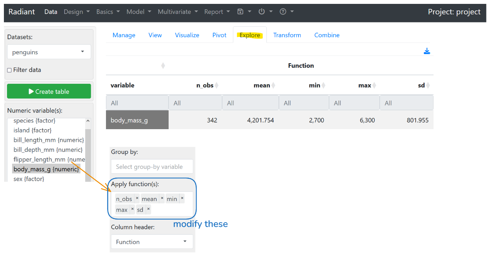
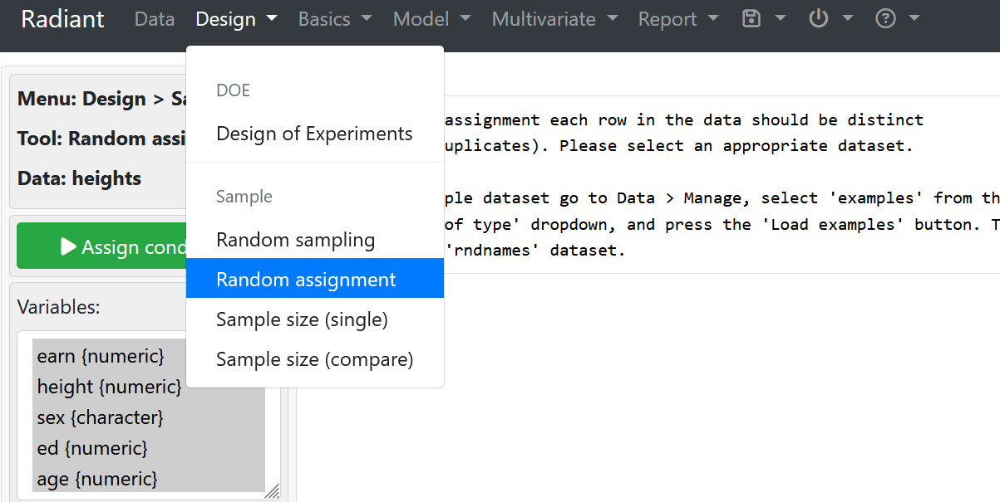
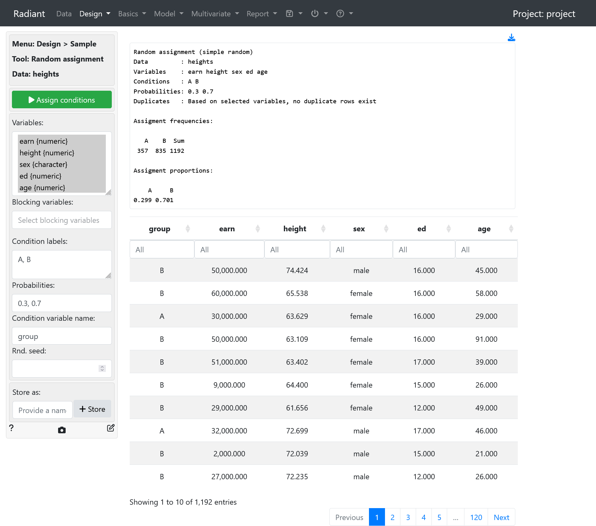

## Radiant

### 1. Using Summary Statistics for tables and graphs
Go to `Explore` tab. Based on the target column/property, we can compute certain summary statistics on the numerical values.

- `var` $\implies$ variance
- `cv` $\implies$ coefficient of variant

Add values into group by to see statistics for each of the factor property (i.e. species, island or sex/gender).

### 2. Using Radiant for Random Assignment
Recall that random assignment makes:
- numerical variables in both treatment and control groups similar in terms of distribution
- categorical variables (non-numeric) in both groups similar in "proportion"

**Design > Random Assignment**

Assigning values to the random assignment menu
- leave the random seed empty -> allows each group/set to be different each time
	