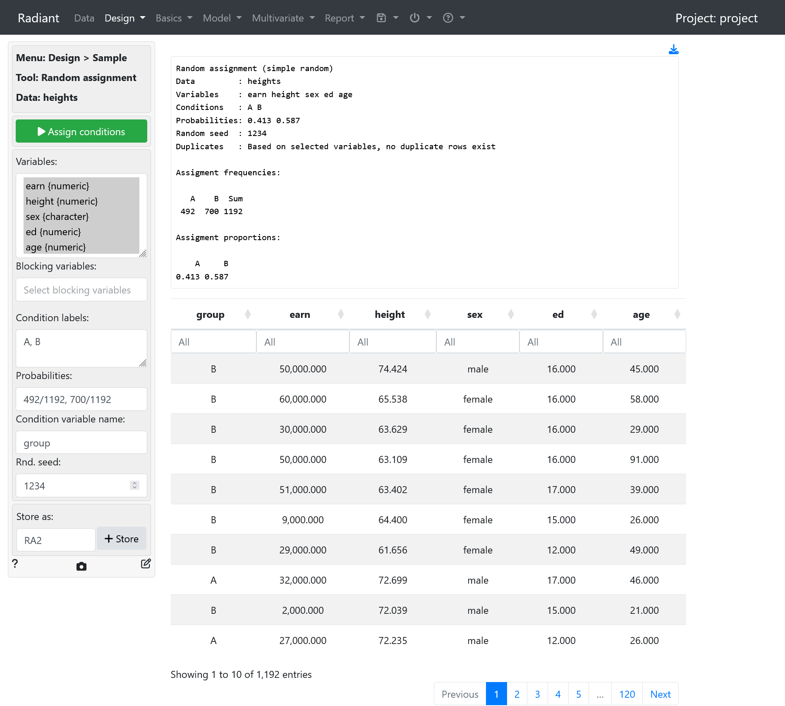
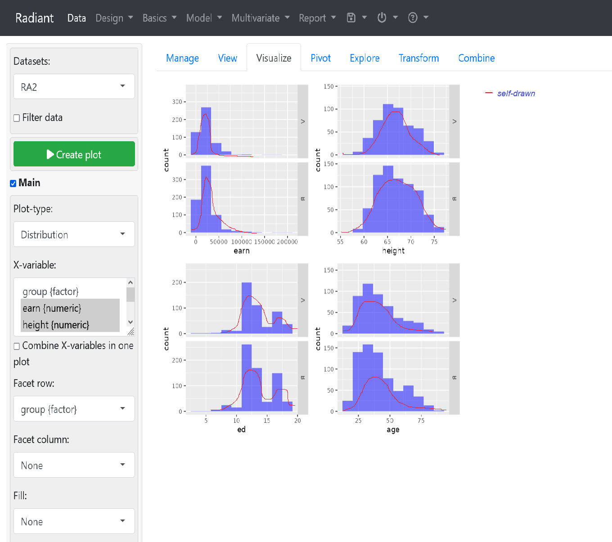
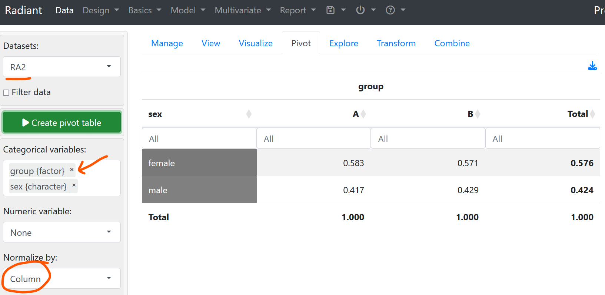
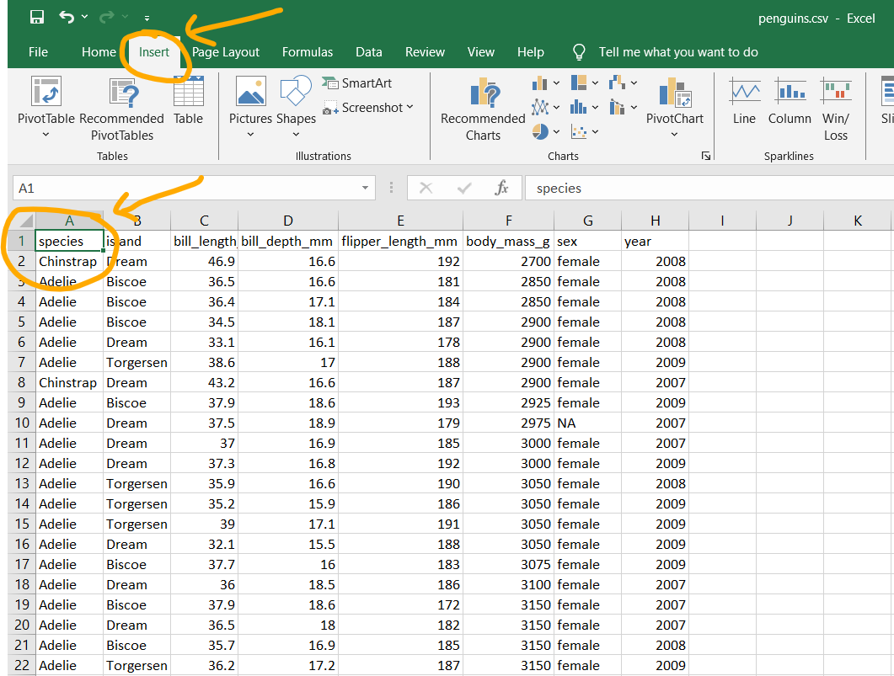
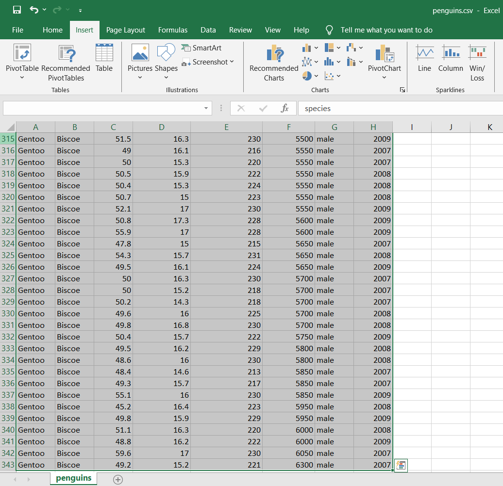
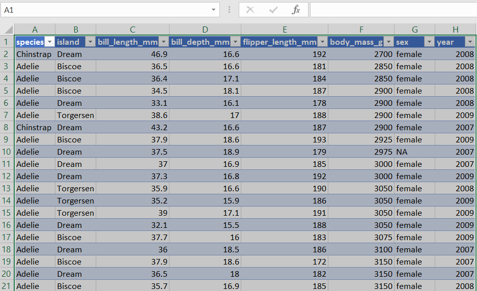
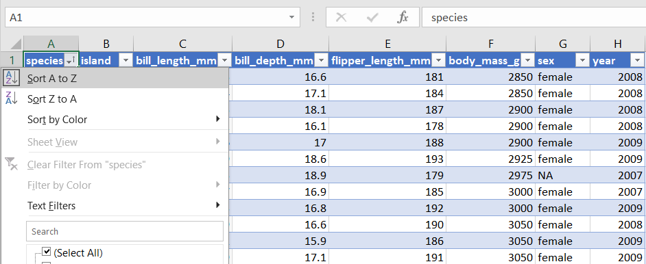
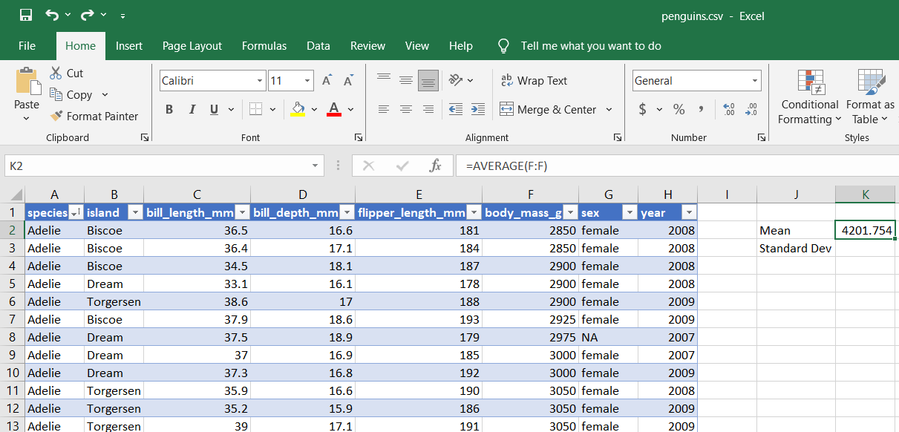
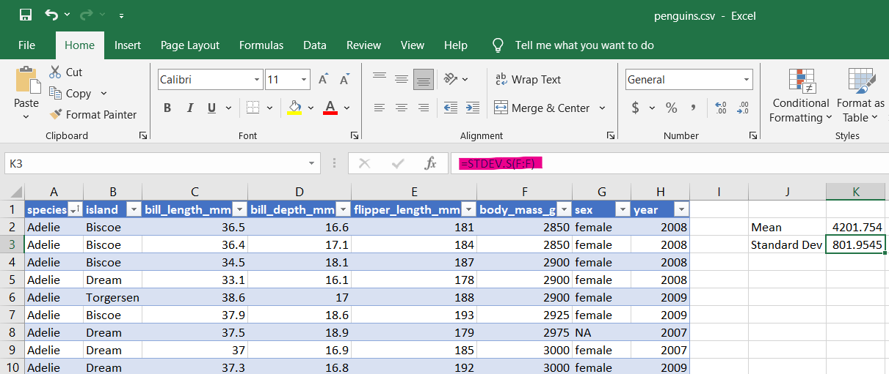
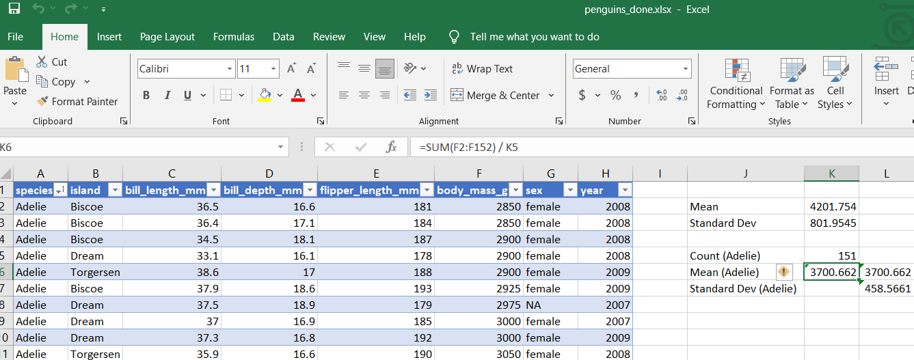

## Radiant

> ***About the dataset:***
> - Provides info on the annual income (`earn`), height in inches, sex, number of years of education and age of 1192 people

### 1. Using Summary Statistics for tables and graphs
Go to `Explore` tab. Based on the target column/property, we can compute certain summary statistics on the numerical values.

- `var` $\implies$ variance
- `cv` $\implies$ coefficient of variant

Add values into group by to see statistics for each of the factor property (i.e. species, island or sex/gender).

### 2. Using Radiant for Random Assignment
Recall that random assignment makes:
- numerical variables in both treatment and control groups similar in terms of distribution
- categorical variables (non-numeric) in both groups similar in "proportion"

Using the **Design > Random Assignment** tab

Assigning values to the random assignment menu
- Good practice: leave the random seed **empty** -> allows each group/set to be different each time
- *Probabilities column:* using `0.3, 0.7` will allocate 30% to group A and 70% to group B
	- can also normalize groups (i.e. divide number to allocate by total number of records): i.e. $P(Grp_A) = \frac{n_A}{total}, P(Grp_B) = \frac{n_B}{total}, where \: n_A + n_B = total$
	
	

**Putting it together - random assignment + plotting**
In this case we save a new dataset, RA2 for the purposes of plotting after we have applied random assignment (probability by normalization).

We can see from the above screenshot that the shape of the curve (distribution) looks quite the same for both groups even though they have different number of elements/subjects.

**Creating a Contingency table**
Under *Data > Pivot*, we can select the saved RA2 dataset and then choose the categorical variable of `group` and then `sex`. We choose ==normalise by column== to obtain to values less than one.

---
## Excel
- finding out the mean and standard deviation based on `penguins.csv` provided.
- Calculating values in column F (`body_mass_g`)

**Step 1:** navigate to Insert menu on the ribbon, place cursor on cell A1.

Step 2: Use shortcut Ctrl + Shift + $\rightarrow + \downarrow$ to select all records.

Step 3: Select `table` under the insert menu to replace the existing csv data records (or alternatively create a new sheet) and click `OK` if prompted.

Step 4: Sort the data according to species by clicking the drop-down arrow and choose `Ascending` or `A-Z`.

Step 5: use the formulas:
- `=average(<column_letter>:<column_letter>)` to compute mean
- `=stdev.s(<column_letter>:<column_letter>)` to compute S.D. value.

