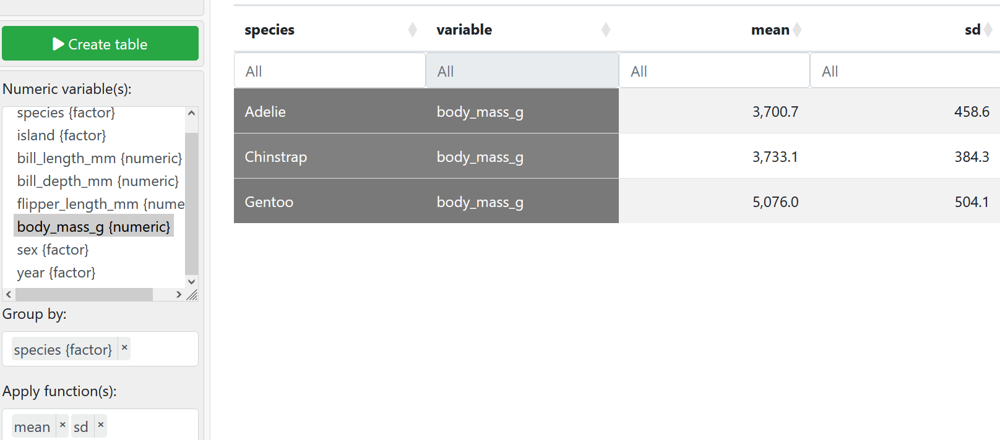

## A. Lesson Objectives and Key Terms
- understand the concept and usage of the remainder of the summary statistics (S.S.):
	- standard deviation
	- variance
	- Inter-Quartile Range (IQR)

- differentiate between design of studies (experiments and observational studies)
	- understand merits, feasibility and ethical concerns of each
---
## B. Standard Deviations, Medians and IQRs
### Sample Variance & Standard Deviation
- are measures of dispersion
#### I. Sample Variance
$$
\sigma^2 = \frac{(x_1 -\bar{x})^2 + (x_2 -\bar{x})^2 + ... + (x_n -\bar{x})^2}{n-1}

$$
- `n` is the number of data points; $x_1$ to $x_n$ is the values contained within the set of inputs (values of numerical *`x`* in the data set).
#### II. Standard Deviation
- provides a way to *quantify* the "spread" of data about the mean.
- formula of S.D. is derived via the *variance* ($\sigma^2$), particularly using the square root operation.
- S.D. value of zero -> there is no spread; S.D. value $\gt{0}$ -> there is some sort of spread in the sample.

**Properties**
- ∴ formula  S.D.  = $\sqrt{variance}$
	$$
		s_x = \sqrt{\frac{(x_1 -\bar{x})^2 + (x_2 -\bar{x})^2 + ... + (x_n -\bar{x})^2}{n-1}}
	$$

	- Intuition on the S.D. formula -> might make sense to: 
		- take difference between each value and mean
		- add up the differences to get the `"total spread"`
		- divide by total number of points to get `"average spread"` 
		- can't do this as average spread will be `0` ❌, $\because$ `+ve` and `-ve` values might cancel each other out

- standard deviation is:
	- **non-negative** (i.e. $\geq 0$).
	- **adding a constant $k$** to a dataset changes the mean $\bar{x}$, but **doesn't change** the standard deviation $s_x$.
		- will only "shift" everything by constant $k$
	- **multiplying** all data points by constant $c$ results in the S.D. being multiplied by the **absolute value of $c$**  *(i.e. $s_{xNew} = s_{xOld} \cdot |c|$)*.

**Example of S.D. calculation** (explicit calculation)
Qn. Consider a simple sample data set $x$ of just `3` points. Given that $x = \{1, 4, 7\}$, find the S.D. value of this dataset.
1. Using the formula, **$s_x = \sqrt{\frac{(x_1 -\bar{x})^2 + (x_2 -\bar{x})^2 + ... + (x_n -\bar{x})^2}{n-1}}$**  we need to first obtain the mean of the dataset.
2. Also given $\bar{x} = \frac{1}{n} \sum x_n$ and $n = 3$

$$
	\bar{x} = \frac{ 1 + 4 + 7 }{3} = 4
$$
$$
	s_x = \sqrt{\frac{(1 -4)^2 + (4 -4)^2 + (7 -4)^2}{3-1}}
$$
$$
	\Longleftrightarrow s_x = \sqrt{\frac{(1 -4)^2 + (4 -4)^2 + (7 -4)^2}{3-1}}
$$
$$
	\therefore s_x = 3.
$$

### Understanding EDA, mean and S.D. through Palmer Penguins dataset
**Palmer Penguins Intro**
- consists of 3 species - Chinstrap, Gentoo and Adelie
- data from 342 penguins with various data points (i.e. species, bill length, bill depth, flipper length, mass, gender etc.)

**Question to answer from the dataset**
How similar are these penguins? -- compare:
1. characteristics like behaviours, habitats and living environments
2. r/s between two or more variables
3. feeding habits across species?
4. mass of the penguins - are males heavier than females within each species?
5. flipper length across species?

Why is it that the Adelie and Chinstrap (species) have almost the same mean mass but yet the S.D. for the Adelie species is higher?
- due to what?
	- gender
	- age, or other factors not inside the dataset?
	- location

**Comparing spread btwn variables**
- when considering to factor in the spread btwn variables, we also need to consider spread relative to the mean (a.k.a. coefficient of variation)

$$
	coefficient\:  of\:  \sigma^2 = \frac{s_x}{\bar{x}} \: \mid \bar{x} \ne{0}
$$
- larger coefficient of variance (i.e. = $\frac{s_y}{\bar{y}} \gt{\frac{s_z}{\bar{z}}}$ $\implies$ spread of $y \gt$ spread of $z$).
### Median
- *definition*: median of set of values in a dataset is the **middle value** after arranging the values of the dataset in ascending or descending order.
	- sort column -> find middle value
- 50th percentile of the data

- formula
	- note: $n$ is the number of element in the set and so $\frac{n+1}{2}$ gives the middle element for odd cases.
$$
	Med(X) = 
\begin{array}{cc}
  \Bigg \{ & 
    \begin{array}{cc}
      X \left[\frac{n+1}{2}\right] & if\: n \: is \: odd. \\
      \frac{X \left[\frac{n}{2}\right] + X \left[\frac{n+1}{2}\right]}{2} & if\: n \: is \: even.
    \end{array}
\end{array}
$$

**Overall vs Subgroup Medians**
- subgroup mean would *NOT* lie closer to the group with the larger proportion $\implies$ knowing the median of the subgroup does not tell one about overall median

**R/s btwn Mean and Median**
- For roughly symmetric distributions, $\bar{x} \approx Med(X)$.
### Quartiles and Interquartile Range (IQR)
- Quartiles allow use to defined another notion/type of dispersion measurement via IQR.
	- generally use software(s) for this computation

|                                  | in terms of percentile | # element                                  |
| -------------------------------- | ---------------------- | ------------------------------------------ |
| $Q_1$ (first quartile)           | 25th                   | $\frac{n+1}{4}$ th                         |
| $Q_2$ (second quartile / median) | 50th                   | $\frac{n+1}{2}$ th or $\frac{2n+1}{4}$ th* |
| $Q_3$ (third quartile)           | 75th                   | $\frac{3(n+1)}{4}$ th                      |
**Formula:**
1. Median: $Med(X) = Q_2$ (see above for full formula)
2. Interquartile Range: $IQR(X) = Q_3 - Q_1$
3. Quartile Deviation = $\frac{Q_3 - Q_1}{2}$

**Similarities btwn IRQ and S.D.** (in terms of properties)
1. $IQR(X) \ must \ be \geq 0, \: \because Q_3 \geq Q_1$
2. $\forall{x}$,  given $c$  is a constant, $x + c$ does not result in $\displaystyle \bigtriangleup{IQR(X)}$, for $\pm{c}$
3. Multiplying all data points by constant $k$ results in $IQR(X)$ being multiplied by $|k|$.
	1. i.e. $IQR(X)_{new} = IQR(X)_{old} \cdot k$
### Deciding which pairs of S.S. to use
- $\bar{x}$ & $s_x$ or Median & IQR -> depends on the distribution of data points.
	- symmetrical vs non-symmetrical data
### Mode
- value that appears the most frequent for a particular feature/variable in a dataset
	- "peak" of the distribution

---
## C. Study Designs
- in study design, we focus on Research Questions that examine a r/s btwn two variables

Exemplar Question: Does **drinking coffee** help students to **pass the maths exam**?
- Dependent: passing the maths exam
- Independent: drinking coffee 

Steps:
1. Take a census or sample of the target population (i.e. students who drink coffee and students who don't drink coffee)
2. Conduct the study
	1. Experimental
	2. Observational

### 1. Experimental Studies
> *def:* intentionally manipulates one variable in an attempt to cause an effect on another variable
- can be also termed "controlled experiment"

goal: provide a cause-effect relationship btwn the two variables
- researcher may hypothesize the relationship using the independent and dependent variables

**Groups within the experiment**
(a) Treatment Group
- Coffee group $\implies$ drinks exactly one cup of coffee every day, for a month (should also make sure that it is around the same time)
	- the "treatment" in this case is coffee

(b) Control Group
- No Coffee group $\implies$ not drink **any coffee** (at all) for a month
- Control is needed because it provides a baseline for comparison w the Treatment group
	- control group might be the same or even outperform the treatment group (in the exam) in this case
- in some cases, might receive some "baseline" treatment elements (**placebo**) to **reduce bias**
	- since bias is an effect of "leaving the control group alone"
	- provided with a substitute to what the treatment group has been provided

- both groups will then take the maths exam (provide experimental results for benchmarking )

**Random Assignment**
- required because there may be other dependent variables affecting the results of the independent variable
	- the coffee-exam r/s case $\implies$ other factors like revision time (shorter vs longer), IQ of subjects, age of subjects etc. etc.
	
- helps to remove the effects of other dependent variables to make the treatment and control group largely similar in terms of other factors/variables

- is an *impartial* procedure using ***chance***
	- each piece of paper has an equal chance of being picked out (==random draw *without replacement*==)
	- Steps:
		1. randomly draw subjects until about half ($\approx 50\%$) of the subjects have been "removed" or grouped into the treatment group
		2. the other half of the main group form the control group

	- helps to create similar treatment & control groups in terms of other factors (i.e. revision time, IQ, age etc.) $\implies$ allows for similar distributions

- treatment and control groups can have different sizes but as long as groups are quite large

**"Random" connotations**
- actual meaning: has a strict meaning related to an **impartial chance** mechanism
- connotation / association: often interchangeable with "haphazard" -> researcher must ensure other experimental variables are not the case

**Placebo**
> *Definitions*
> 1.  Placebo: Treatment with no active ingredients and no effects
> 2.  Placebo effect: response observe when subject receive placebo treatment but **still show some positive effects.**, even if the treatment has no effect

**Blinding**
- somewhat like blindfolding the subjects
- blinded subjects don't know which group they belong to (treatment or control)
	- can add a placebo ("substitute for the treatment" taken by the control group) to help make the blinding more effective
	- helps to prevent subject's own beliefs and in turn behaviours from affecting the results of the experiment(al study)

- Returning to coffee-and-substitute example
	- Each subject won't know if they're in the treatment or control group -> are blind to how the test or control might look like (treatment and placebo should smell and taste the same)
	- Each subject is provided with a drink every morning

- assessors marking the test also need to be blinded to avoid biases (being more lenient to one group compared to the other)

> *def:* Double-blinding experiment occurs when both the subjects and assessors (of the experiment) are blinded.

### 2. Observational Studies
> *def*: Observational study involves observing individuals and measures variables of interest

- helps to eliminate ethical issues associated with the experiment (i.e. ethical to inject low doses of virus consent provided?)
	- just record data based on real-world cases (don't force or incentivize participation)
- researcher **does NOT attempt** to **directly** manipulate one variable to cause an effect on another variable.

$\therefore$  observational studies do not provide convincing evidence supporting a cause-effect relationship.

**Groups within the experiment**
- Will still  use the terms treatment group (i.e. smokers) and control group (non-smokers) even though no actual "treatment" is applied from the researcher's end.

	Treatment group $\Longleftrightarrow$ exposure;  Control Group $\Longleftrightarrow$ non-exposure
### 3. Experimental vs Observational Studies

> *def* Confounder: variable that influences both independent and dependent variable.

| **Experimental Studies**                                                                                  | **Observational Studies**                                                                       |
| --------------------------------------------------------------------------------------------------------- | ----------------------------------------------------------------------------------------------- |
| Assigned by researcher (should have only one independent variable -> random assignment + double-blinding) | Decided by subjects themselves (usually lifestyle choices)                                      |
| Can provide cause-and-effect relationship (CAUSATION)                                                     | Cannot provide cause-and-effect relationship (can only corroborate and expand on other studies) |
|                                                                                                           | Can still provide evidence on association; can show correlation/relationship                    |
|                                                                                                           |                                                                                                 |
- we wish that we as researchers can do an experiment all the time -> might not be ethical (people might not respond well, governing their lifestyle choices)

---
## D. Generalisability of Studies 
Even if an experiment is:
- well-designed
- no ethical issues
- has double-blinding and random assignment,

We still might not be generalize the results to the entire population / everyone (recall generalisability has [3 other criteria](../Week%201/Week%201%20Video%20Lecture%20Notes.md###%207.%20Generalisability) and a total of 4 criterion)
- still have to consider the other factors.