## Radiant - one variable
1. Import the dataset, `kidneystones.csv`
2. Transform data types as factor before continuing (since we are dealing with categorical values)
3. Create **pivot table** with `Outcome` listed as single categorical variable
	1. To obtain the bar plot below, select *show plot* in the left sidebar.

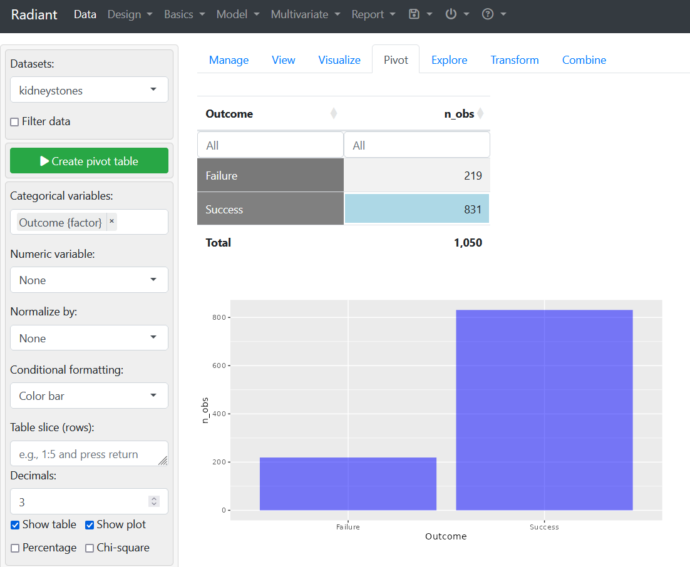

4. Normalize by `total` (total counts) to create a normalized contingency table.
5. Check the `percentage` checkbox.

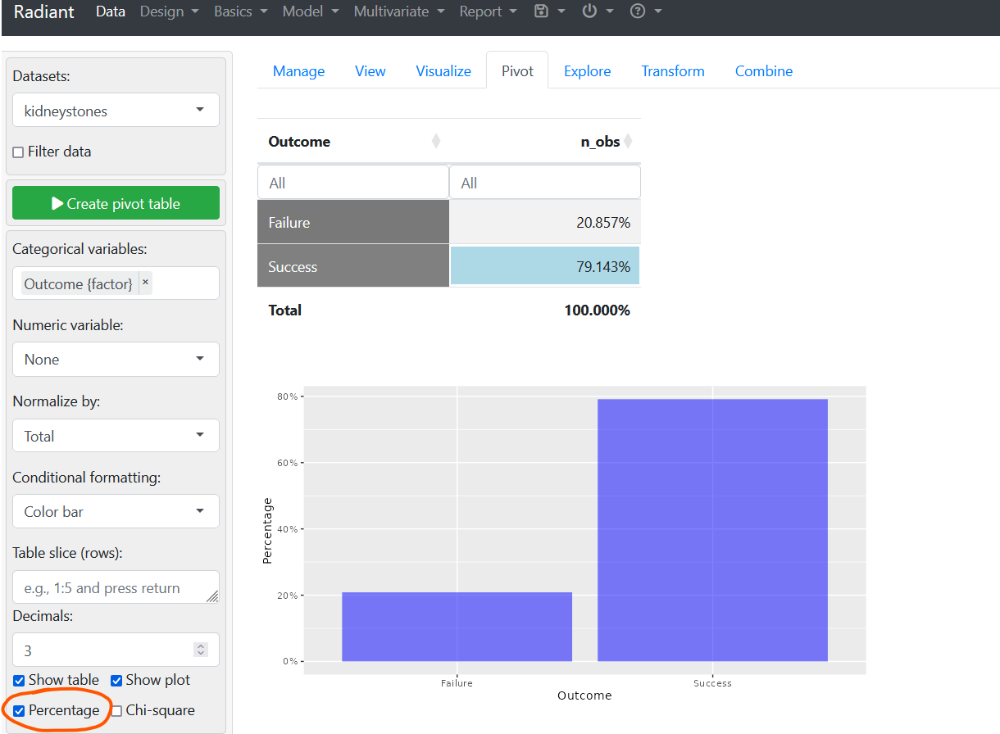

6. Optional: change the level of precision using the `Decimals` field
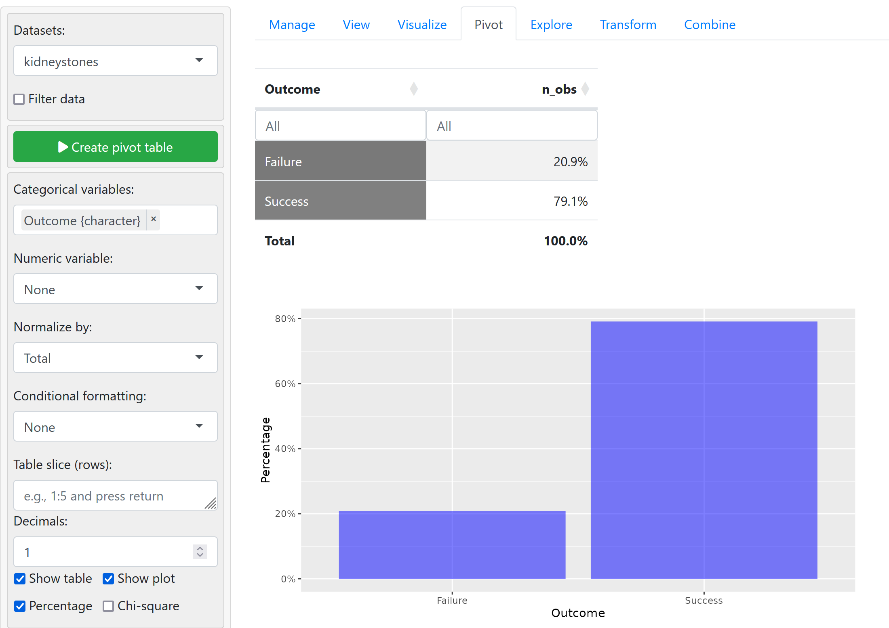
## Radiant - two variables
Same procedure as above, except we need to order the categorical variables (Independent first $\to$ `treatment` then dependent $\to$ `outcome`).
- make sure that the variables are in order before plotting (just add the second one then reorder them as desired)

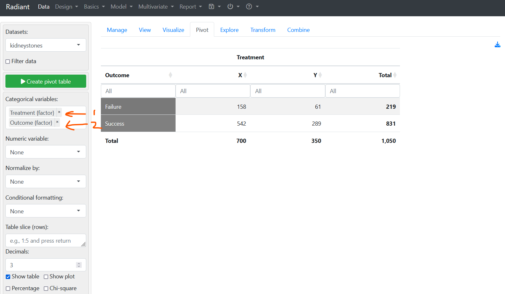

Do the same thing as above. For stacked bar plot, check `Fill` in plot type.
- can change the normalization factor as `Column` (not shown here)
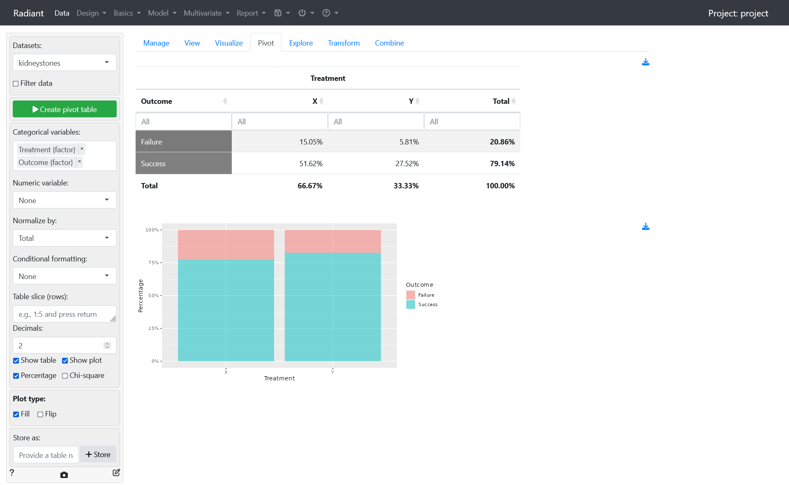

Normalize by column to show table with row proportions / percentages


---
## Excel - one variable
utilizing the following excel functionalities in creating the spreadsheets
- sort and filter function
- pivot table function

We first have to gather some statistics (counts of the two possible outcomes).

### The primitive way
Select all columns then click `Filter`, then click on a specific outcome value and observe the Count and the bottom pane. Repeat the same process for the other outcome value.

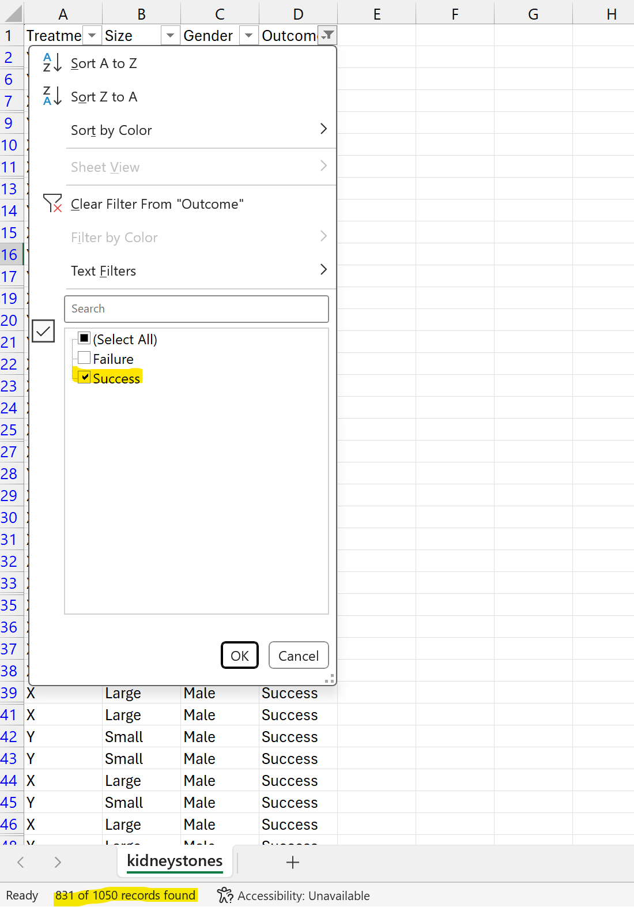

### The faster way
- Use of excel formulas
```r
# format: =COUNTIF(<column_selection>, <string_value>)
=COUNTIF(D:D, "Success")

# format: =ROUND(<target_value>, <precision>)
=ROUND(H3/COUNTA(D:D),4)
```
	
 - precision specifies the number of decimal places (i.e. `4 d.p.` in this case).

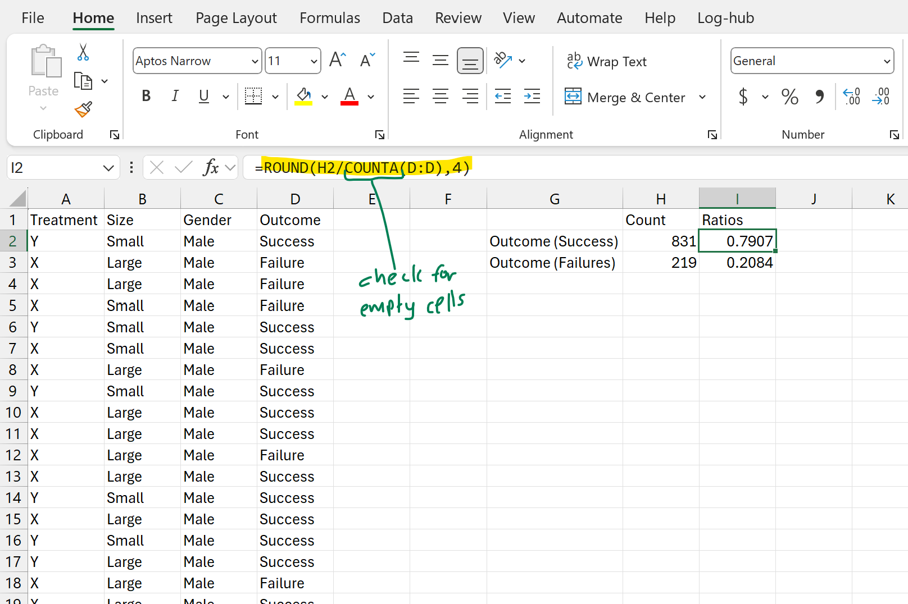

**Go to `Insert > Pivot Chart`** and then select the entire dataset with `Ctrl` +` Shift` + `→` + `↓`.

Then drag and drop `Outcome` into both the **Legend (Series)** and **Values**.

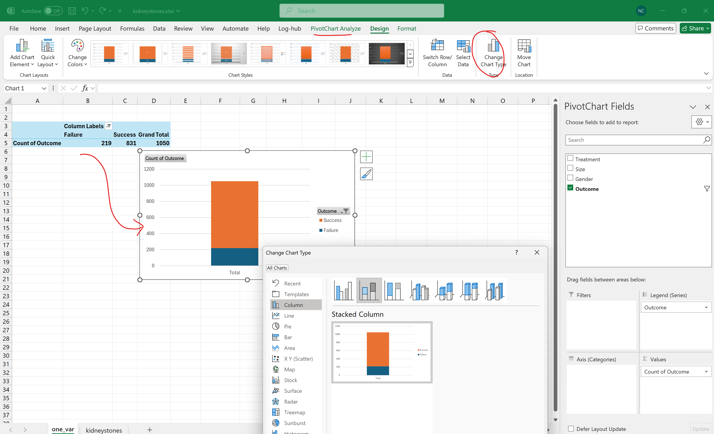

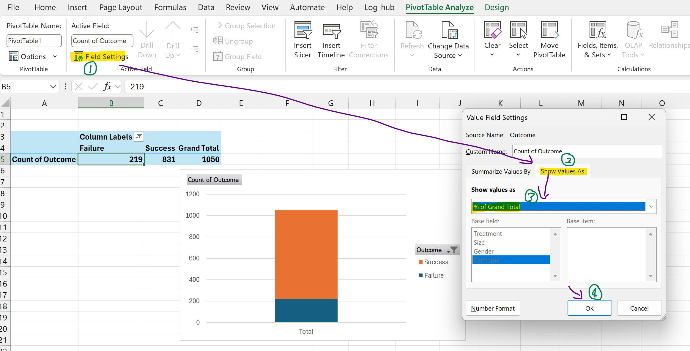

**Changing / Adding chart properties**

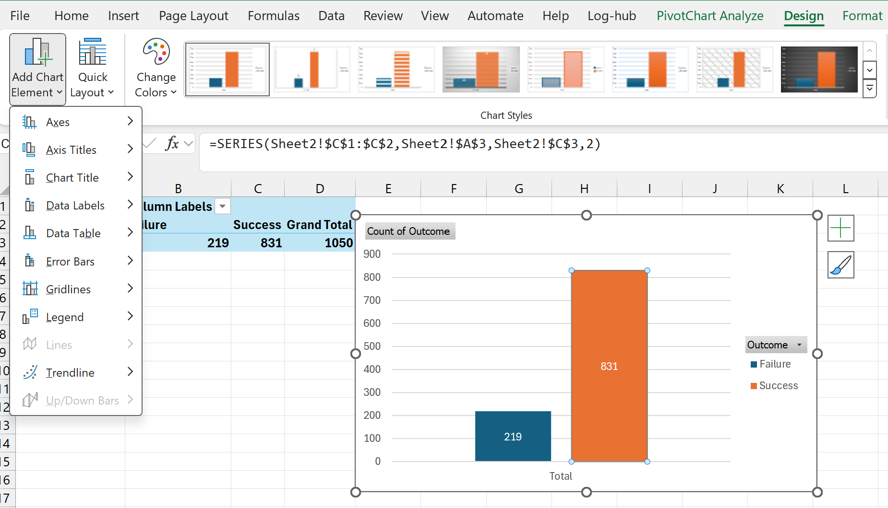
## Excel - two variables
Drag the Treatment field as rows and Outcome as columns, similar to radiant. For the value, we put the Count of treatment.

Drag and drop on the menu as follows.
**Column:** `Outcome`
**Values:** `Count of Treatment`
**Rows:** `Treatment`

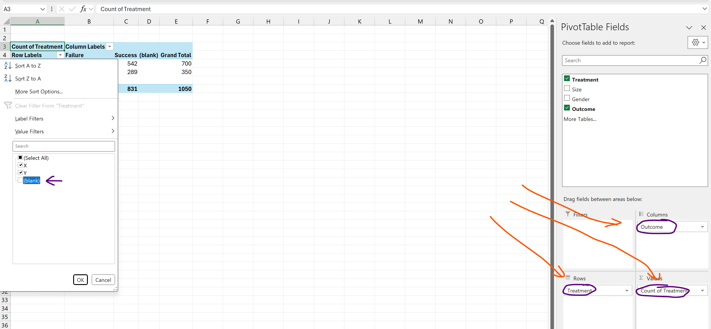

Click on PivotTable Analyze > Pivot Chart

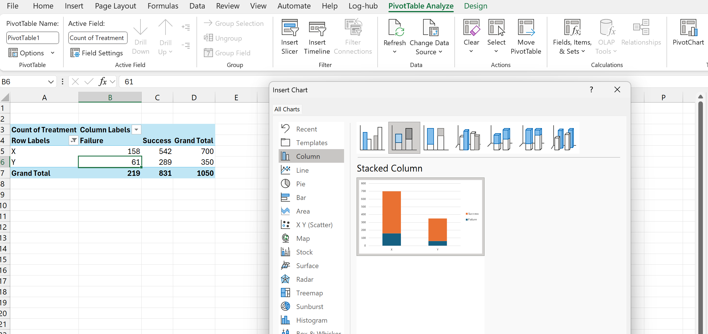

To adjust to percentage, click on one value in the table itself, the go to **Pivot Table Analyse > Field Settings > Show Values As** then select `Percentage of Row Total`.
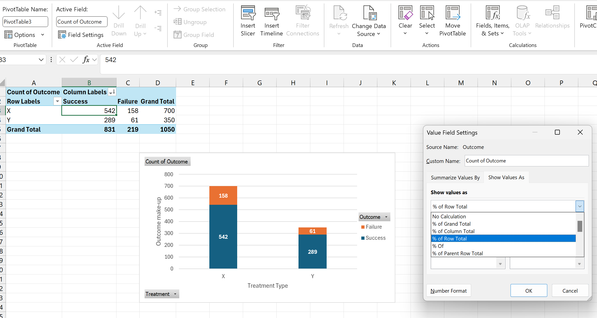


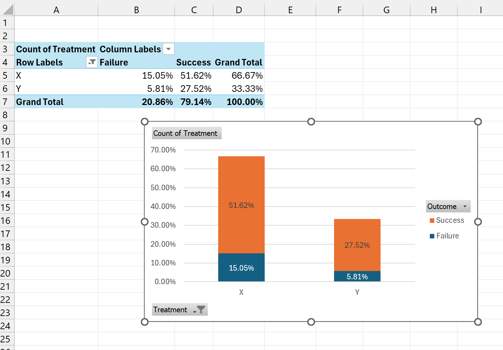