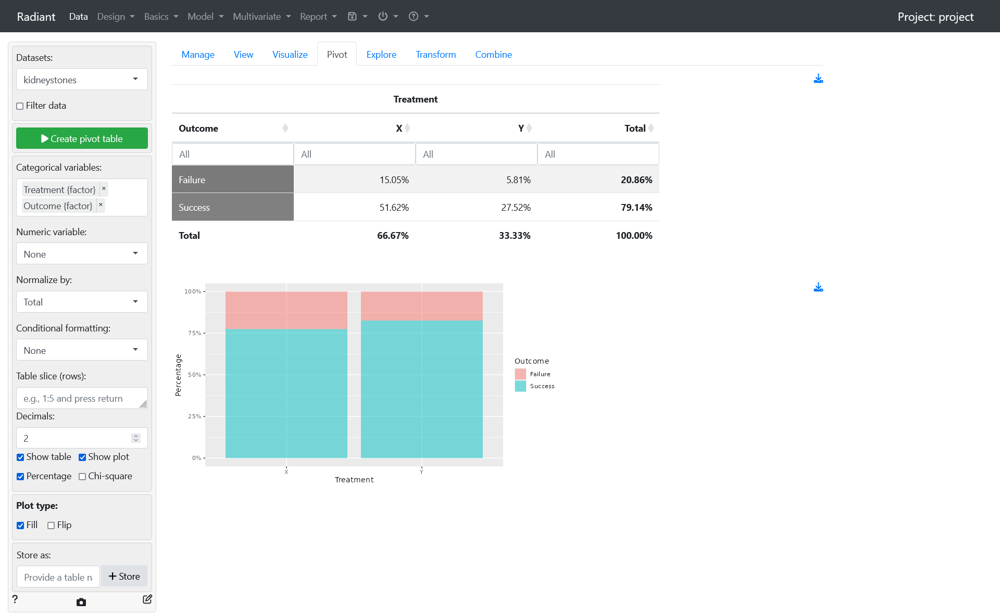
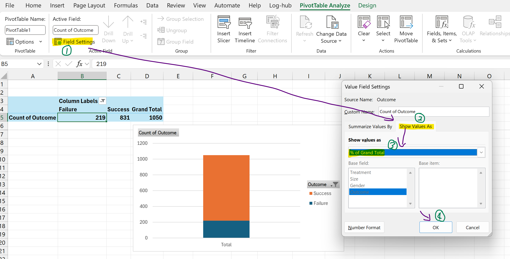
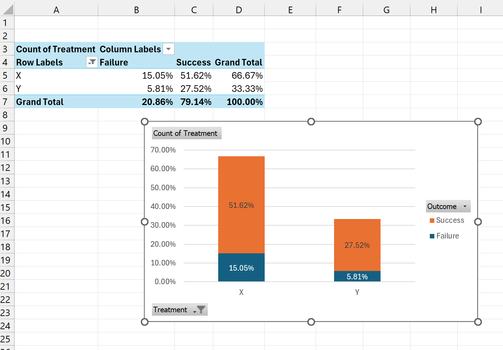

## Radiant - one variable
Import dataset
Transform data types as factor
Create pivot table with `Outcome` listed as categorical variable

- Normalize by `total` (total counts) to create a normalized contingency table.
- Check the `percentage` checkbox.

## Radiant - two variables
Same procedure as above, except we need to order the categorical variables (Independent first then dependent).

Do the same thing as above. For stacked bar plot, check `Fill` in plot type.

Normalize by column to show table with row proportions / percentages

---
## Excel - one variable
- sort and filter function
- pivot table function

Select all columns then click `Filter`

## Excel - two variables
Drag the Treatment field as rows and Outcome as columns, similar to radiant. For the value, we put the Count of treatment.

Click on PivotTable Analyze > Pivot Chart

