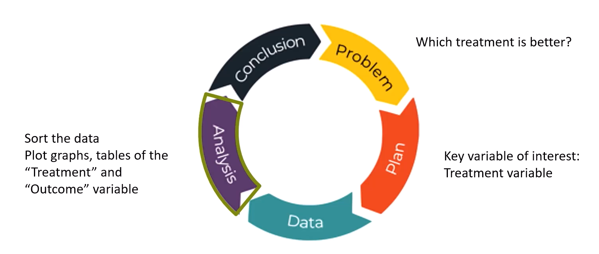
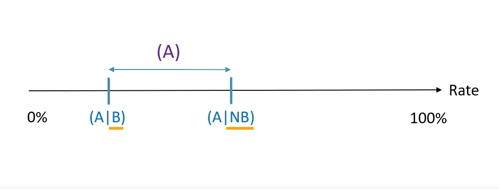

## A. Learning Outcomes and Key Terms - for categorical data analysis (Part 1)
- EDA techniques and concepts for **categorical data**
- describe categorical variables using frequency and rates
- use and interpret contingency tables and bar graphs for categorical variables
- what is a conditional rate versus a joint rate?
- basic rule of rates, symmetry rule
- establish association between categorical variables

---
## B. Understanding Rates
- using the kidney stones dataset `kidneystones.csv` throughout this chapter.
	- `Treatment` - nominal categorical (i.e. two categories $\implies$ X and Y)
	- `size` - ordinal categorical (i.e. small, large)
	- `Gender` - nominal categorical (i.e. two categories $\implies$ Male and Female)
	- `Outcome` - nominal categorical (i.e. two categories $\implies$ Success and Failure)

- When looking just at absolute numbers, there is a tendency to misinterpret the higher count to be better, even though the percentage of success for it may not be so.
### Using PPDAC
- Problem (may have more than one): *Do treatments provided to patients in general tend to be successful?*
- Plan (not conducting experiment, no need for measurement or quantification): Take a look at **`outcome` variable** to show us if the treatment was a success $\implies \: \because$ this is an observational study .
- Data (reveal interesting trends)
- Analysis: sorting the data, plot graphs etc.
- Conclusion: 
	- preliminary types of conclusions may lead us to ask more questions

### 1. Categorical Variables
> *def* Rate: a quantity or amount that can be represented through a fraction, proportion or percentage (measured as compared to something else)

***Using example dataset:***

`Rate(Success)` = $\frac{831}{1050} = 0.791\: or\: 79.1\%$.
### 2. Tables and Plots
- allows us to visualize the data and come to the same conclusion
#### i. Single variable
- can use either a dodged bar plot or a stacked bar plot to measure the variable being explored.
- can normalize values as a percentage or fraction instead of just a count.

* can also use these plots for two variables
	* can normalize the y-axis to become 100% (transform to become a 100% bar plot)
#### ii. Two variables
using PPDAC chart to answer new question discovered

> *def:* A two-way contingency table is a cross-classification of observations by the levels of two discrete variables

- can make use of data to determine if treatment X or Y is better in giving a Successful outcome?
	- make use of a `2x2` data/contingency table (not to be confused with a *two-way relative frequency table*)
		- dependent variable (outcome) as the row headers of the table (horizontal)
		- independent variable as the column headers of the table (vertical)

### 3. Marginal, Conditional & Joint rates
#### Marginal Rate
> *def*: Marginal rate - how the numbers in the margin of the table relate to (change in respect with) categorical variables
- to calculate, take the **row or column total** (depending on the question) and divide it by the **grand total**.

> *Formulae:*
> - Row Marginal rate: $\frac{Row \: Total}{Grand \: Total}$
> - Column marginal rate: $\frac{Column \: Total}{Grand \: Total}$

#### Conditional Rate
> *def:* Conditional rate - consider one part of the population and "ignore" the others (provided based on a **given condition**)

> *Formulae*: 
> - *In General*:  $rate(Y \: | \: X) =  \frac{rate(Y \land X)}{rate(X)}$
> - $Conditional\: rate = \frac{Joint\: count\: of\: Y \land X}{Marginal\: Count\: of\: X}$

- total number of participants / size of EITHER control OR treatment group will function as the denominator of the conditional rate.
	- conditional rate because only certain margins or conditions are taken into account
#### Joint Rate
i.e. based on "filtering out" both the independent and dependent variables
- looking at **all observations** as the base / total (as the denominator)

> *Formulae:*
> $Joint\: rate = \frac{Joint\: count\: of\: X \land Y}{Grand \: Total}$

### 4. Normalization and Parity
- normalization makes it such that in an experiment (in this case) comparing two dependent variables, we can make it such that the **discrepancy in the sizes** of the treatment and control groups are addressed
	- can be through the calculation of rates *instead of using absolute numbers* which might provide a false representation of the success of either treatment.

***Workflow:***
1. Compares the success rates of treatments X and Y
2. Given a treatment, what is the success rate? (calculate and normalize for both treatments in question, in this case X and Y).
3. Make a fair comparison (i.e. use some similar scale 
	1. Treatment X, ~77 out of 100 patients found success
	2. Treatment Y, ~83 out of 100 patients found success (positively associated with the success of the treatment)
4. Conclusion

Calculate the percentages across all rows (limit focus to one row at a time)
- use of marginal percentages

**Conclusions drawn**
- Treatment Y is positively associated to the success of the treatment (tend to see that Treatment Y and successes go hand-in-hand).
- Treatment X is negatively associated to the success of the treatment.
- Associative relationship between the Treatments and their outcomes.

---
## C. Association
> *def* Association: there is a relationship between some variables -- the independent variable (i.e. the treatment type) and the dependent variable (i.e. the outcome of the treatment)

- how two variables are related to each other

- use of the term association when we don't know if the y variable is entirely based on the x variable.
	- use of rates to determine that one of the dependent `x` variables resulted in a better `y` variable or outcome.

- association is NOT causation!
### Types of Conditional rates
| Case                         | Remarks                                  |                                                                    |
| ---------------------------- | ---------------------------------------- | ------------------------------------------------------------------ |
| Rate(A \| B) = Rate(A \| NB) | *Not* Associated / Association is absent |                                                                    |
| Rate(A \| B) < Rate(A \| NB) | Positive association                     | Presence of A, when B is present is stronger than when B is absent |
| Rate(A \| B) > Rate(A \| NB) | Negative Association                     | Presence of A when B is present is weather than when B is absent   |

**Assumptions**
A: Successful Treatment (kidney stone size was reduced)
NA: Failed Treatment (kidney stone size roughly the same or worse, bigger)
B: Treatment X was administered on the patient
NB: Treatment Y was administered on the patient

Notes: 
- `x | y` is read as "x given y"
- `A` and `B` represent the **first** dependent (outcome) and independent variables respectively.
- `NA` and `NB` represent the **second** dependent and independent variables respectively.

### Misconceptions when establishing association
**Exercise**
`rate(A | B) < rate(A | NB)`
- x neg associated w success
- y pos associated w success

`rate(NA | B) < rate(NA | NB) ≡ rate(A | B) < rate(A | NB)`
- x pos associated w failure
- y neg associated w failure

*Given x pos associated w failure ≡ x neg associated w success*

---
## D. Rules that govern rates
### 1. Symmetry Rule
> Notation:
> $rate(X | Y) \: <trichotomy\_operator> \:  rate(X | NY) \: \iff \: rate(B | A) <trichotomy\_operator> \: rate(B | NA)$
- first statement must hold for second statement to hold AND second statement must hold for first statement to hold.

**Consequences of the symmetry rule**
checking for association (use either one)
1. $rate (A|B) \neq rate(A|NB)$
2. $rate(B | A) \neq rate(B|NA)$
The above imply that the variables are either positively or negatively associated

### 2. Basic rule on rates
- The overall rate (`rate(A)`) will always lie between `rate(A|B)` and `rate(A|NB)`

**Three Consequences of the basic rule on rates**
> `rate(A | B)  ≤ rate(A) ≤ rate(A | NB)` or vice versa
- As `rate(B)`  approaches 100%, `rate(A)` gets closer and closer to `rate (A | B)` as compared to `rate(A | NB)` (should still fulfil the above criteria)

> $rate(B) = 50\% \implies rate(A) = \frac{\left[ rate(A\:|\:B) + rate(A\:|\:NB) \right]}{2}$
- if the `rate(B)` is exactly 50%, then the `rate(A)` is exactly halfway between the boundaries of `rate(A | B)` and `rate(A | NB)`.

> $rate(A | B) = rate(A | NB) \implies rate(A) = rate(A | B) = rate(A | NB)$
- If there is equality between A given B and A given not B, then the overall rate of A would also be the same value