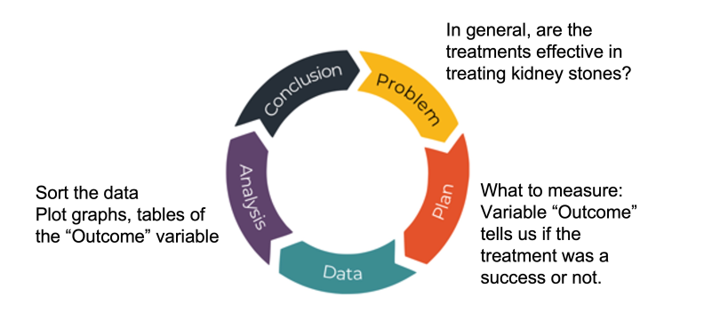
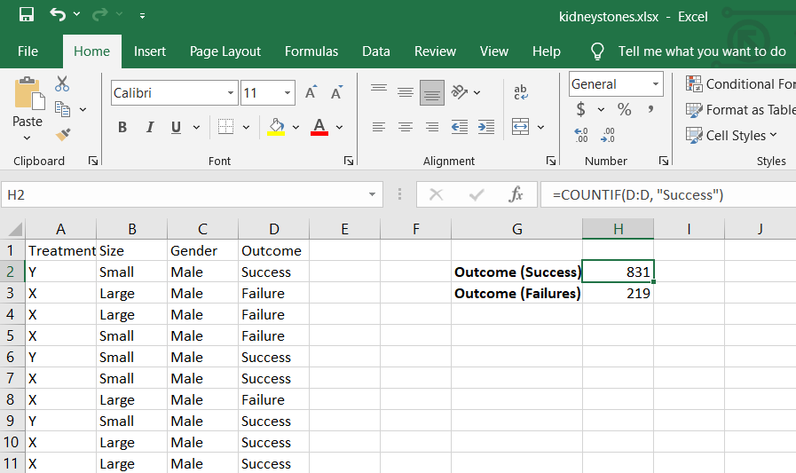
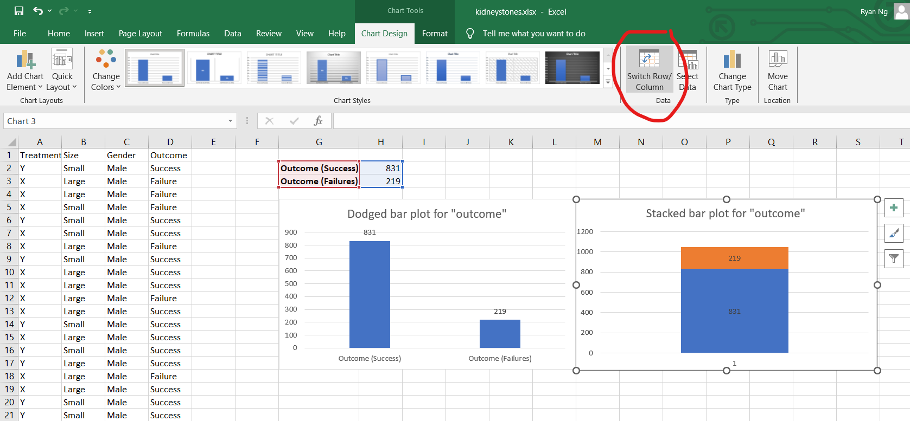

## A. Learning Outcomes and Key Terms - for categorical data analysis (Part 1)
- EDA techniques and concepts for **categorical data**
- describe categorical variables using frequency and rates
- use and interpret contingency tables and bar graphs for categorical variables
- what is a conditional rate versus a joint rate?
- basic rule of rates, symmetry rule
- establish association between categorical variables

---
## B. Understanding Rates
- using the kidney stones dataset `kidneystones.csv` throughout this chapter.
	- `Treatment` - nominal categorical (i.e. two categories $\implies$ X and Y)
	- `size` - ordinal categorical (i.e. small, large)
	- `Gender` - nominal categorical (i.e. two categories $\implies$ Male and Female)
	- `Outcome` - nominal categorical (i.e. two categories $\implies$ Success and Failure)
### Using PPDAC
- Problem (may have more than one): *Do treatments provided to patients in general tend to be successful?*
- Plan (not conducting experiment, no need for measurement or quantification): Take a look at `outcome` variable to show us if the treatment was a success.
- Data (reveal interesting trends)
- Analysis: sorting the data, plot graphs etc.
- Conclusion: 
	- preliminary types of conclusions may lead us to ask more questions

### 1. Categorical Variables
> *def* Rate: a quantity or amount that can be represented through a fraction, proportion or percentage (measured per unit of something else)

***Using example dataset:***

`Rate(Success)` = $\frac{831}{1050} = 0.791\: or\: 79.1\%$.
### 2. Tables and Plots
- allows us to visualize the data and come to the same conclusion
#### i. Single variable
- can use either a dodged bar plot or a stacked bar plot to measure the variable being explored.
- can normalize values as a percentage or fraction instead of just a count.

#### ii. Two variables
- can make use of data to determine if treatment X or Y is better in giving a Successful outcome?
	- make use of a `2x2` data/contingency table
		- independent variable as the row headers of the table
		- dependent variable (outcome) as the column headers of the table

### 3. Marginal, Conditional & Joint rates

