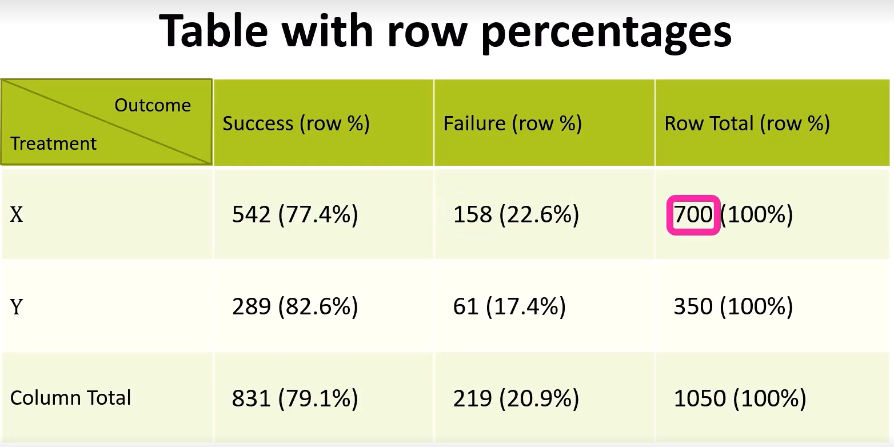

## A. Learning Outcomes and Key Terms - for categorical data analysis (Part 1)
- EDA techniques and concepts for **categorical data**
- describe categorical variables using frequency and rates
- use and interpret contingency tables and bar graphs for categorical variables
- what is a conditional rate versus a joint rate?
- basic rule of rates, symmetry rule
- establish association between categorical variables

---
## B. Understanding Rates
- using the kidney stones dataset `kidneystones.csv` throughout this chapter.
	- `Treatment` - nominal categorical (i.e. two categories $\implies$ X and Y)
	- `size` - ordinal categorical (i.e. small, large)
	- `Gender` - nominal categorical (i.e. two categories $\implies$ Male and Female)
	- `Outcome` - nominal categorical (i.e. two categories $\implies$ Success and Failure)
### Using PPDAC
- Problem (may have more than one): *Do treatments provided to patients in general tend to be successful?*
- Plan (not conducting experiment, no need for measurement or quantification): Take a look at `outcome` variable to show us if the treatment was a success.
- Data (reveal interesting trends)
- Analysis: sorting the data, plot graphs etc.
- Conclusion: 
	- preliminary types of conclusions may lead us to ask more questions

### 1. Categorical Variables
> *def* Rate: a quantity or amount that can be represented through a fraction, proportion or percentage (measured per unit of something else)

***Using example dataset:***

`Rate(Success)` = $\frac{831}{1050} = 0.791\: or\: 79.1\%$.
### 2. Tables and Plots
- allows us to visualize the data and come to the same conclusion
#### i. Single variable
- can use either a dodged bar plot or a stacked bar plot to measure the variable being explored.
- can normalize values as a percentage or fraction instead of just a count.

* can also use this plots for two variables
#### ii. Two variables
> *def:* A two-way contingency table is a cross-classification of observations by the levels of two discrete variables

- can make use of data to determine if treatment X or Y is better in giving a Successful outcome?
	- make use of a `2x2` data/contingency table (not to be confused with a *two-way relative frequency table*)
		- independent variable as the row headers of the table
		- dependent variable (outcome) as the column headers of the table

### 3. Marginal, Conditional & Joint rates
#### Marginal Rate
> *def*: Marginal rate - how the numbers in the margin of the table relate to (change in respect with) categorical variables
- to calculate, take the **row or column total** (depending on the question) and divide it by the grand total.

> *Formulae:*
> - Row Marginal rate: $\frac{Row \: Total}{Grand \: Total}$
> - Column marginal rate: $\frac{Column \: Total}{Grand \: Total}$

#### Conditional Rate
> *def:* Conditional rate - consider one part of the population and "ignore" the others (provided based on a **given condition**)

> *Formulae*: 
> - General:  $rate(Y \: | \: X) =  \frac{P(Y \land X)}{P(X)}$
> - $Conditional\: rate = \frac{Joint\: count\: of\: Y \land X}{Marginal\: Count\: of\: X}$

- total number of participants / size of EITHER control OR treatment group will function as the denominator of the conditional rate.
	- conditional rate because only certain margins or conditions are taken into account
#### Joint Rate
i.e. based on "filtering out" both the independent and dependent variables
- looking at all observations as the base (or denominator)

> *Formulae:*
> $Joint\: rate = \frac{Joint\: count\: of\: X \land Y}{Grand \: Total}$

### 4. Normalization and Parity
- normalization makes it such that in an experiment (in this case) comparing two dependent variables, we can make it such that the **discrepancy in the sizes** of the treatment and control groups are addressed
	- can be through the calculation of rates *instead of using absolute numbers* which might provide a false representation of the success of either treatment.

***Workflow:***
1. Compares success rates of treatments X and Y
2. Given a treatment, what is the success rate? (calculate and normalize for both treatments in question, in this case X and Y).
3. Make a fair comparison (i.e. use some similar scale 
	1. Treatment X, ~77 out of 100 patients found success
	2. Treatment Y, ~83 out of 100 patients found success
4. Conclusion

---
## C. Association

> *def* Association: there is a relationship between the independent variable (i.e. the treatment type) and the dependent variable (i.e. the outcome of the treatment)

- use of the term association when we don't know if the y variable is entirely based on the x variable.

- positive association (i.e. independent variable and [successful] dependent variable tend to occur together) ↑ x, ↑ y
- negative association ↑ x, ↓ y