## Using Radiant for 3 variables
- creating a new variable to keep track of the treatment type and size of stone together.
- remember to change the variable types to `factor` prior to starting on the lab exercise.

1. Go to the **Transform** tab in Radiant
	1. Click **Create** from the `Transformation Type` dropdown
	2. Name the new variable `TS` which concatenates the variables `treatment` and `size` together, delimited by a period *(i.e. `X.Large`, `Y.Small` etc.).*

		

```r
TS = interaction(Treatment, Size)
```

2. *Optional:* Verify the new column has been created under **Radiant > Data > Manage**
	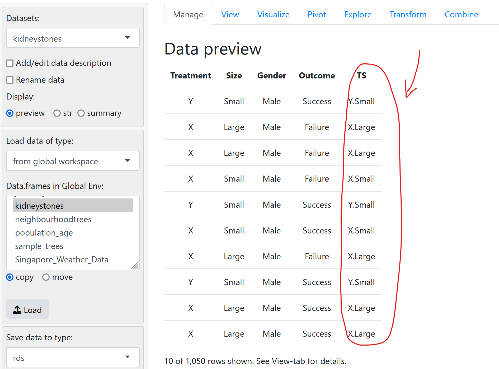

3. Go back to the **pivot tab** to create the pivot chart in Radiant
	1. Plot the Categorical variables of `TS` against `Outcome (factor)`
		1. may want to uncheck `percentage` if selected
		2. *optional step:* Head to **Transform** tab to first change `TS`'s type to `character`
		
	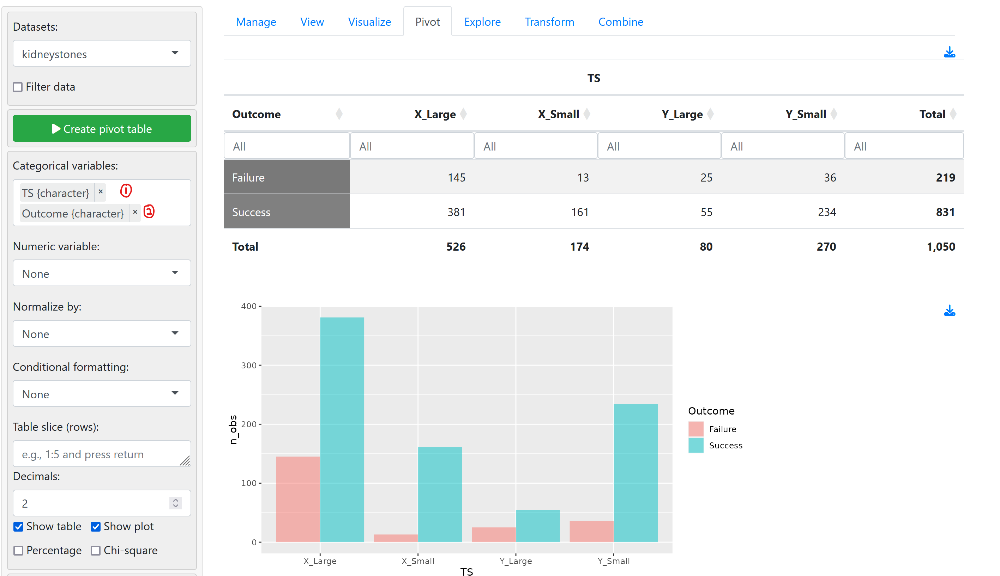

4. We can normalize the values by column and apply the `fill` property for a 100% stacked bar plot here as well.

	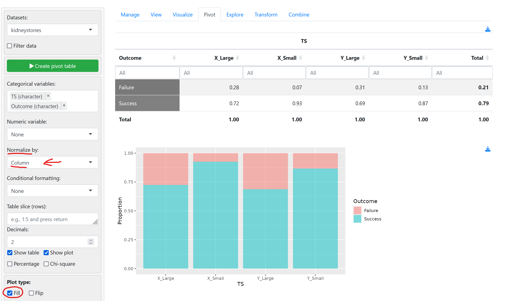


---
## Using Excel to construct 3-variable table
- is a modified version of a `2x2` table with sub-division into groups

Drag and drop on the menu as follows.
**Filters:** `Size`
**Column:** `Outcome`
**Values:** `Count of Treatment`
**Rows:** `Treatment`

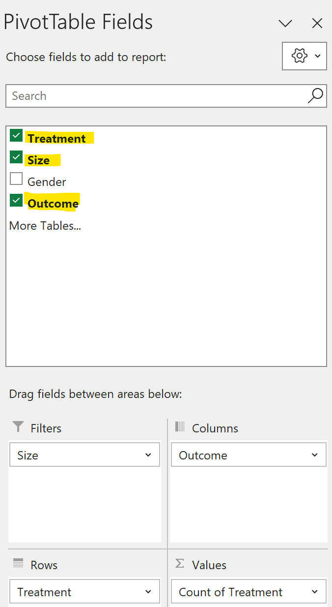

We can create a new table containing 3 variables to analyze if Simpson's Paradox is present.
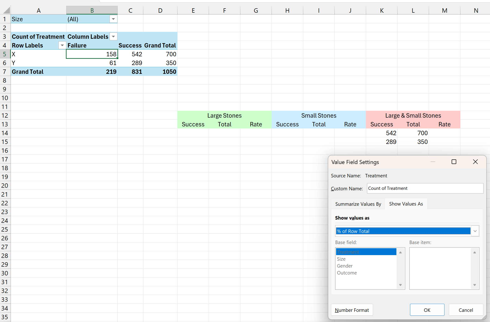

Use the **Field Settings** to change the column values to percentages (i.e. `% of column total`)

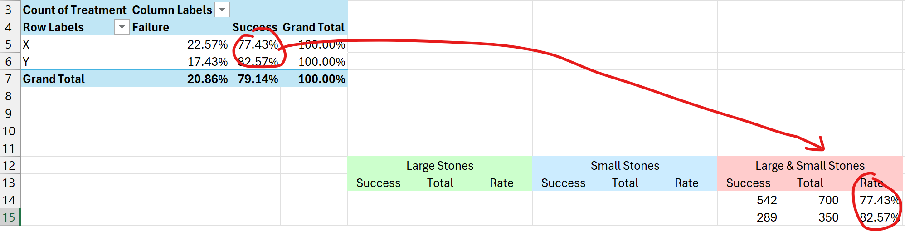

Thereafter, we can use the filter on `size` to derive the rest of the values from the pivot table itself.
- remember to use the filter and toggle between the options in Field Settings to obtain the right rate and count values for each of the sub-categories.

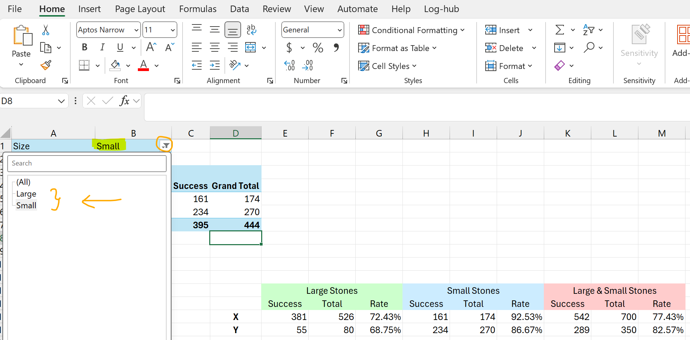
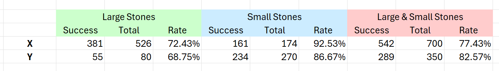

---
## Using Excel to construct 3-variable sliced graph

1. Similar to the above, just for graphs (refer to other steps to obtain the plot)

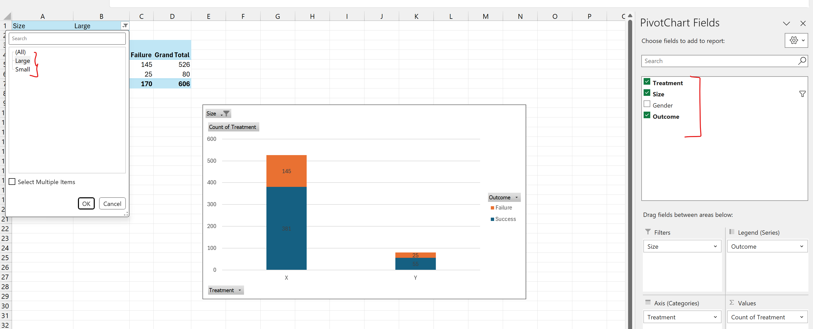

2. Move the variable `size` from *filter* to `axis(categories)`
	- Now we have:
		- **Column:** `Outcome`
		- **Values:** `Count of Treatment`
		- **Axis Categories:** `Treatment`, `Size`

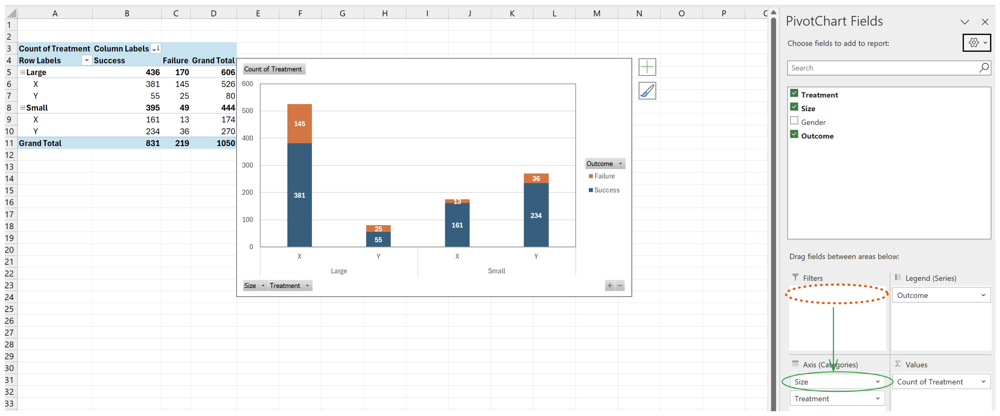

3. We can now reorder the columns if we wish to obtain sorted by treatment then followed by size
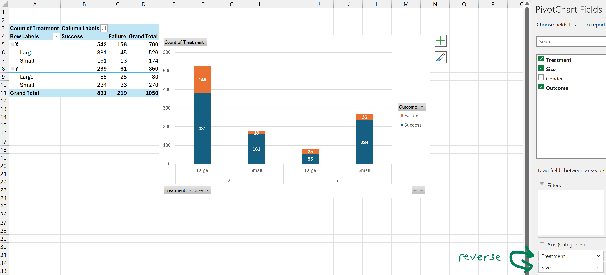


4. We can also change it back to percentages if we wish.
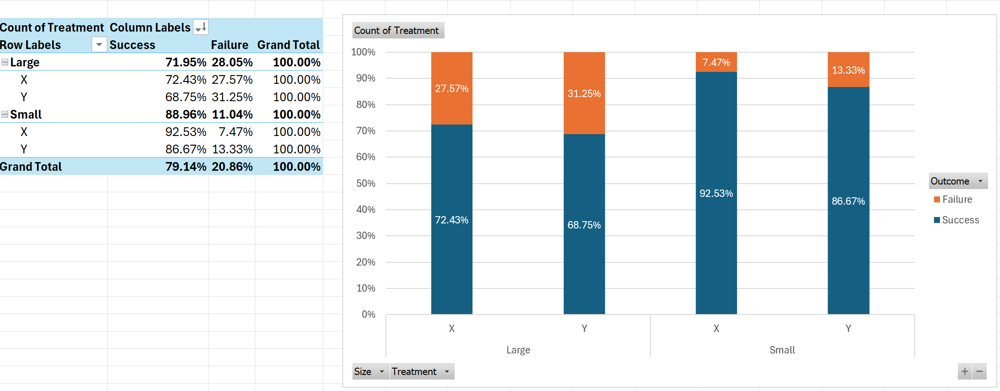