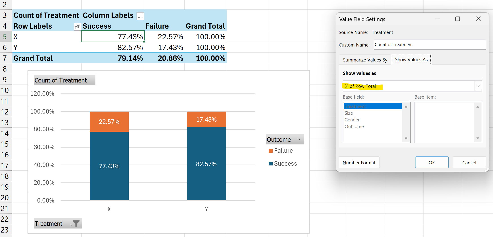
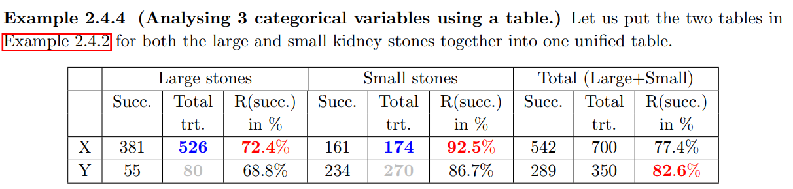

## A. Learning Outcomes and Key Terms - for categorical data analysis
- Simpson's paradox
- define and identify potential confounding variables in studies

**Recap**
Gone through *a few cycles* of the PPDAC
- Are the treatments helping? *Yes, as there is a high success rate in general.*
- Which treatment is better? *Treatment Y is positively associated with success* (i.e. Treatment Y is better than Treatment X)
- Anything else? $\implies$ Should we continue sending patients to get Treatment Y in this case?
	- few more variables like gender and kidney stone size were ignored in this case

Should ask oneself of the type on visualizations to do.
- Binary Categorical + Association $\implies$ use stacked bar plots (i.e. PivotChart feature on excel)
 

---
## B. Simpson's Paradox
> *def:* The phenomenon when a trend appears in the **majority** of several groups of data, but disappears or reverses when the groups are combined

- the two variables in the study of question are no longer associated (i.e. $rate\left(A|B\right) = rate\left(A | NB\right)$)
- when you aggregate all the results, the trend says one thing; whereas when we subdivide the results into sub-groups, the trend says something very different.

When exploring a particular (usually dependent) variable, we use *(a) simple plots* and *(b) summary stats* to discover interesting trends.
### 1. Identification
- not considering other (categorical) variables that may affect conclusion
	- Examples
		- for **large stones**, `rate(Success | X) > rate(Success | Y)` (i.e. `rate(A | B) > rate(A | NB)` ) $\implies \: \therefore$ for large kidney stones, treatment X is much better
		- in every single age bucket, being in Italy means a higher chance of survival from COVID than in China, yet overall it is the opposite (i.e. being in China means one has a higher chance of survival than Italy) -- because there are much more older people who have gotten COVID as compared with China

 Use of a sliced bar graph to compare three categorical variables and determine association `rate(A | B) = rate(A | NB)`???

**Causes of the paradox**
- the sample size for one particular group is very different as compared to another.

Able to conclude that we should give treatment X in all cases since we have found out that it has a positive association with success for both big and small stones (regardless of stone size).
### 2. Analyzing Simpson's Paradox using Slicing
- allows us to take into account a third or fourth variable
	- Treatment X has been used predominantly to treat large kidney stones, with a lower success rate because they are harder to treat, thus making it seem like it performs worse than Treatment Y.

	- Treatment Y has been used to treat **more patients** with small stones, thus yielding a higher rate of success for this category

	

- after identifying Simpson's paradox $\implies$ this implies that there is definitely a confounding variable associated with the other two variables under investigation.
---
## C. Confounders
> *def:* A confounding variable (or **confounder**) is a variable that is **associated to both the two other variables** that we are investigating.

- as long the variable(s) is associated in some way to the main variables under investigation, we call these confounders

- cases of wasting time by filling in surveys with background questions (age, gender etc.)
	- researchers might not be sure if they can determine if a variable is a confounder or not
	- by collecting more info or other variables, the researchers can associate variables and determine if there might be presence of confounders

- use the symmetry rule or graphical comparison to show association between confounder and dependent/independent variable
### Controlling confounders
1. Use of **slicing** to control confounders
2. Collection of *more* background data / variables that might be confounders (not entirely feasible and costly)
	1. Require researchers to collect info beyond research questions
3. **Randomized assignment** (proportional allocation based on other variables)
	1. might be difficult and unethical to force patients on undergoing specific treatment type $\implies$ observational study
#### Cons of Non-randomized studies
1. Unsure if all confounders are controlled
2. Limited conclusion
3. Evidence of association, *but not* causation.