## Data Preparation -- Radiant
- read in `housing_raw.csv` into Radiant
### Step 1: Creating a new variable
- we will compute the age of the HDB flat in a new column, using the formula $age \: = year(month) \: - lease\_commence\_date$
	- extract the year from the date `month`
	- subtract the `lease_commence_date`
	- obtain the `age` variable and save it into a new column

```r
age = year(month) - lease_commence_date
```

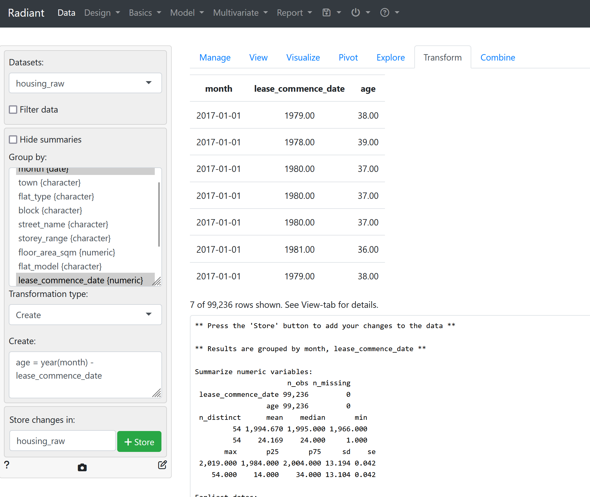

### Step 2: Extracting the relevant variables
- Pick only a few other variables
	- `month` : date $\implies$ specifically zoom in on the Year 2021 only
	- `floor_area_sqm`: numeric
	- `age`: numeric
	
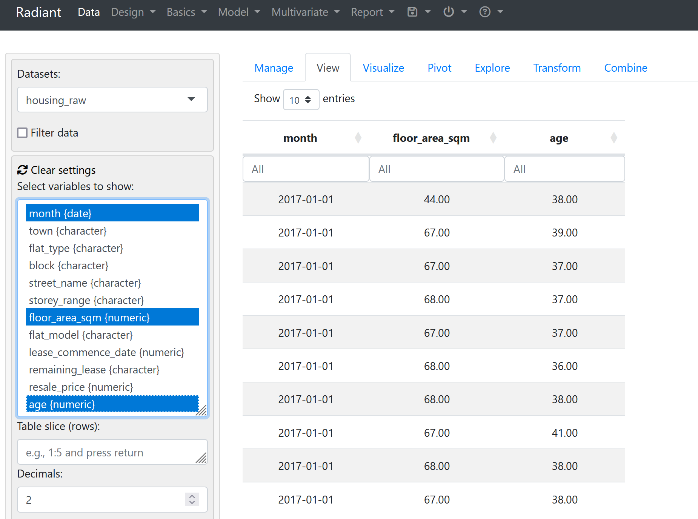


- use the syntax `<YYYY-MM-DD> ... <YYYY-MM-DD>` to filter records for the year 2021 only.
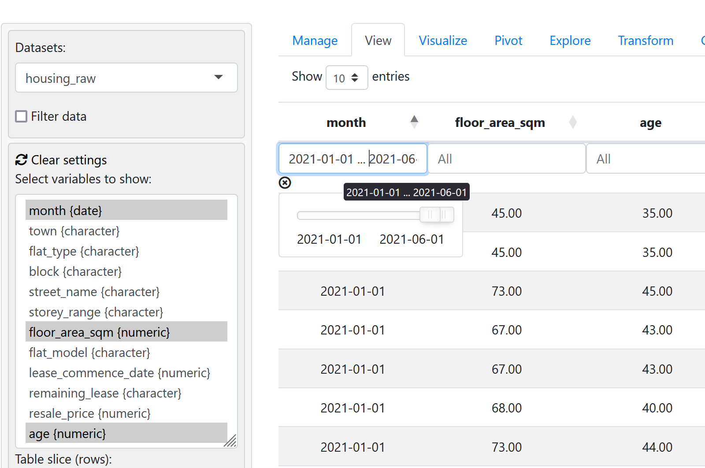

- store the data stored for later use and repeat to create `jan20tojun21.csv` as well

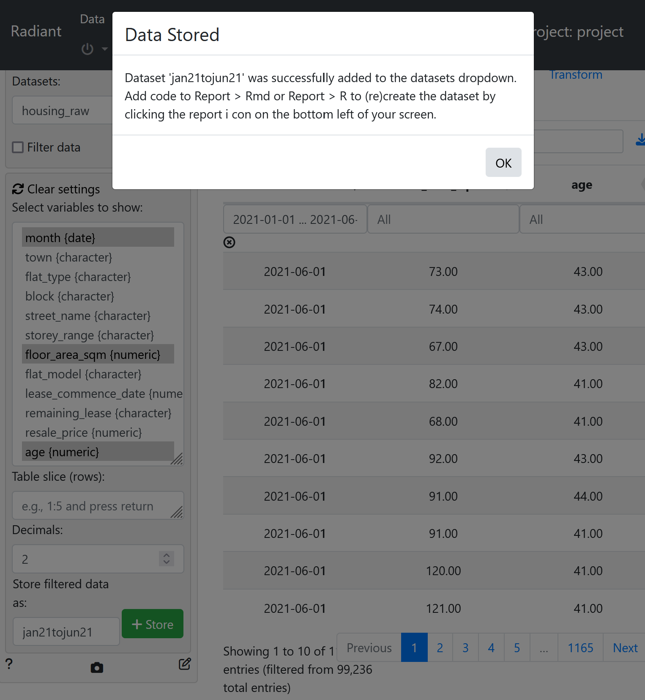

- save the data in the `Manage` pane

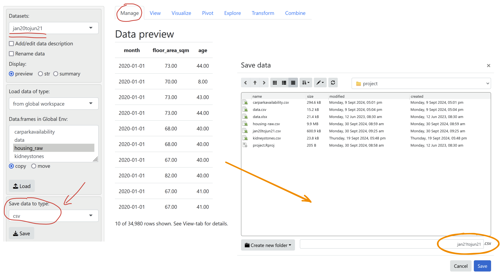

---
## Histograms -- Radiant
- Go to the `Visualize` tab
- Select the relevant variable (in this case, it is `age`)

### Using the GUI to create Histograms
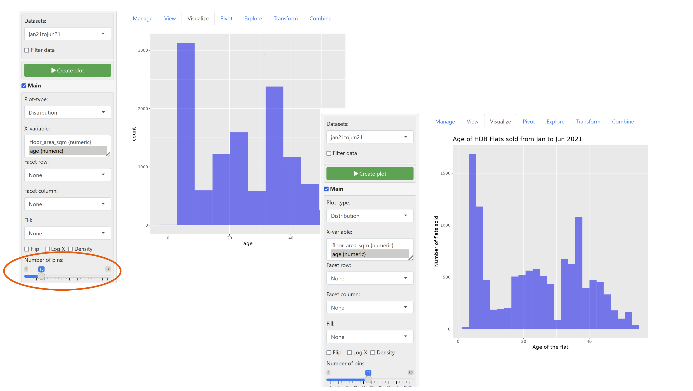


### Use the CLI/Scripts to create Histograms
- use the pencil icon (**Report Results**) in the bottom left of the sidebar 

```r
# specifying the bin width
jan21tojun21 %>% # pass the whole dataset to the next function (i.e. ggplot)
ggplot(aes(x = age)) +
geom_histogram(breaks = seq(0, 54, by = 2), fill="orange", color="blue") +

# provide a title and override default labels for the plot
ggtitle("Age of HDB flats sold btwn Jan and Jun 2021") +
xlab("age of the flats") +
ylab("number of flats sold")
```


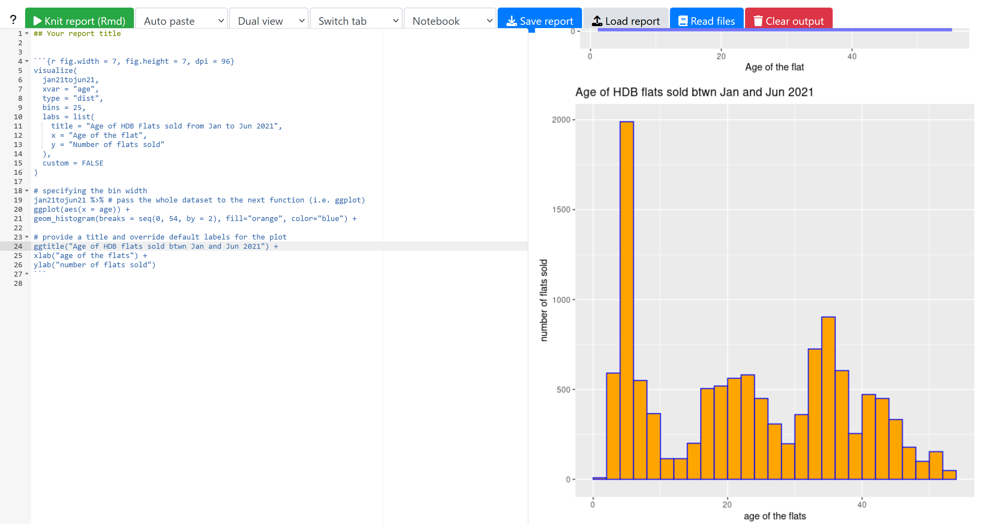

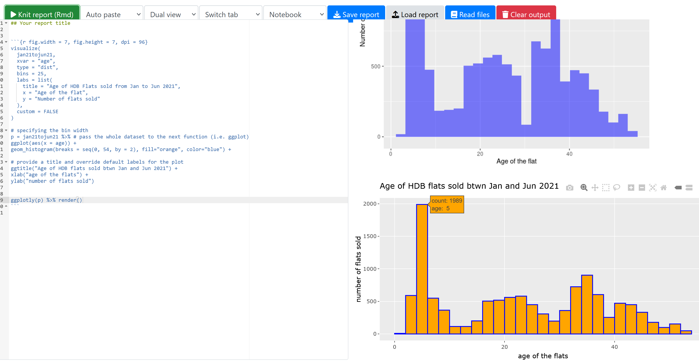

---
## More Histograms in Radiant
- load in the dataset `exam_grades.csv`
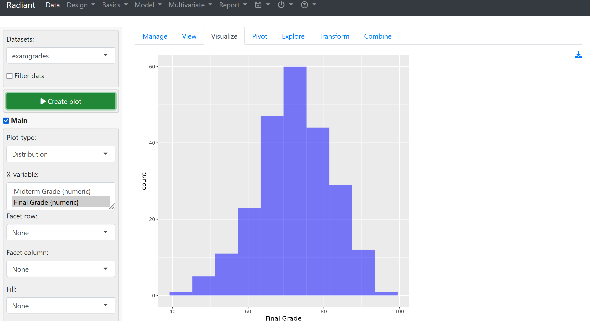
- to make histograms with specific bin size, we need to use the **Report Results** panel again.


---
## Creating a Histogram in Excel
- Inserting a histogram into excel
- Right click the `x-axis` to adjust the bin sizes

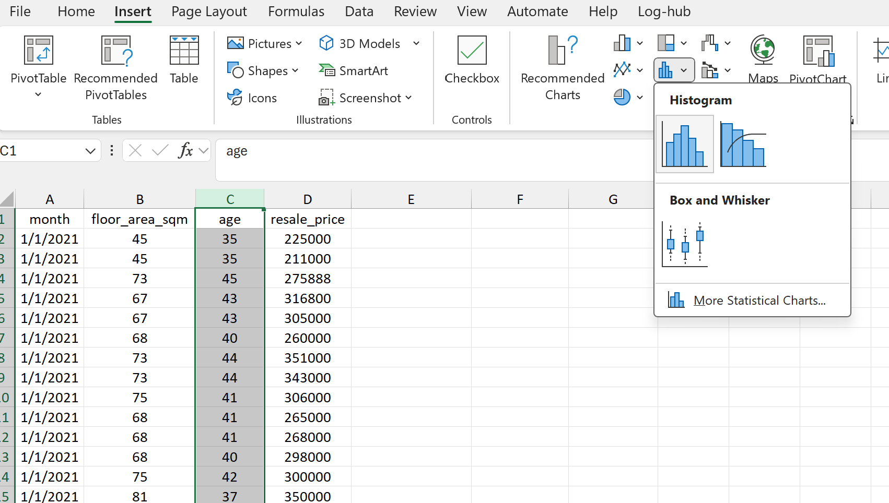


- We can insert Axis Titles by using **Chart Design > Add Chart Element**
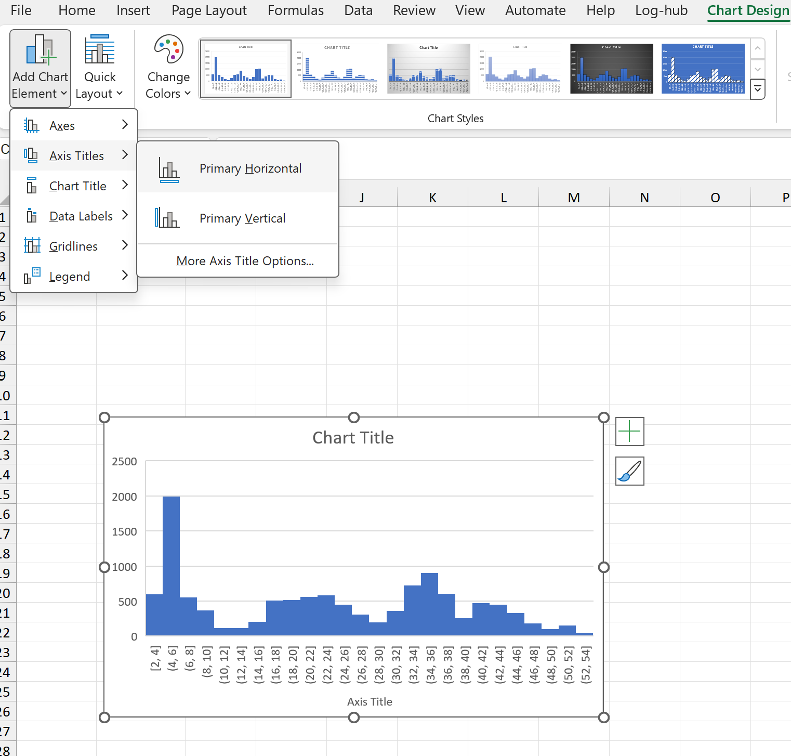


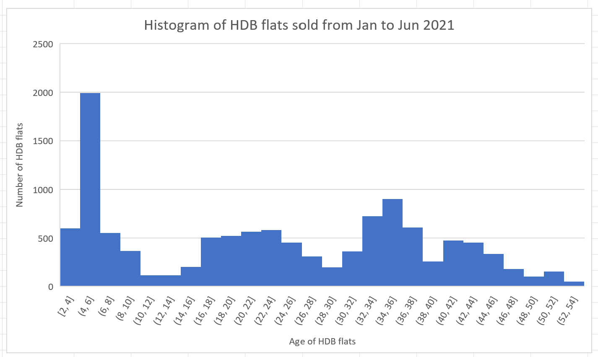


---
## Creating a Histogram using Analysis Toolpak
- Navigate to **Data > Data Analysis** to use the Analysis Toolpak in Excel
- We also need to first specify the bin sizes

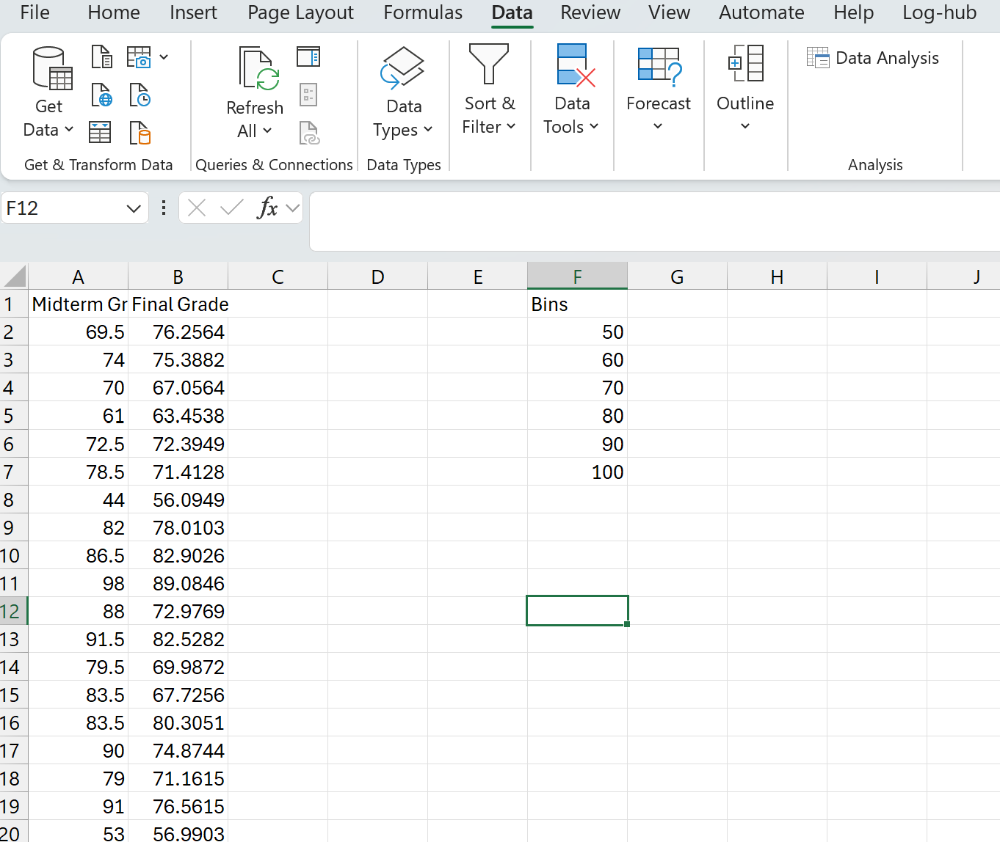

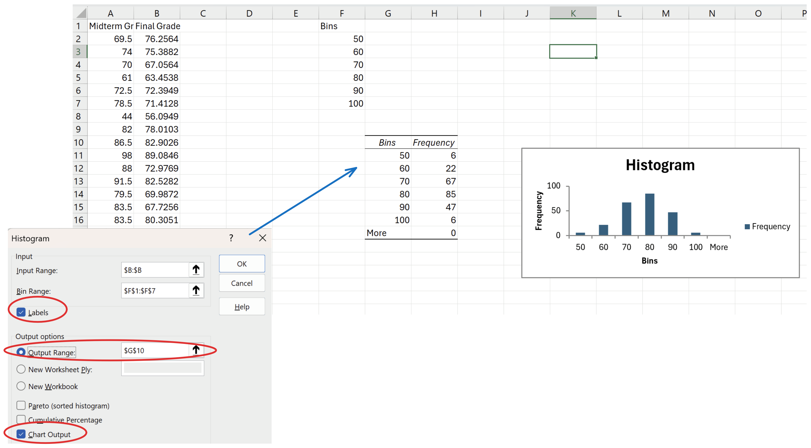

- set gap width to **zero**
- delete the `More` Column.
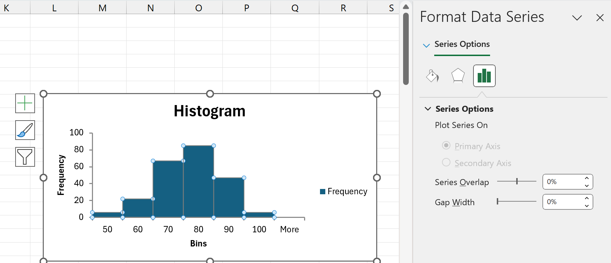