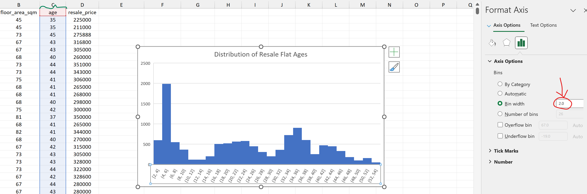
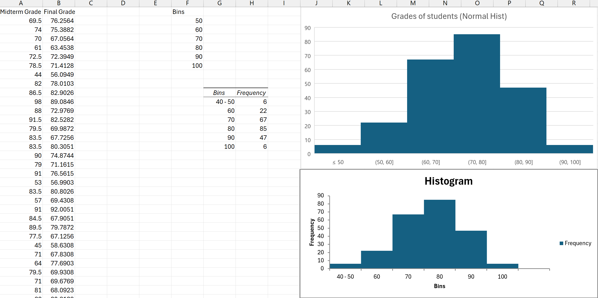
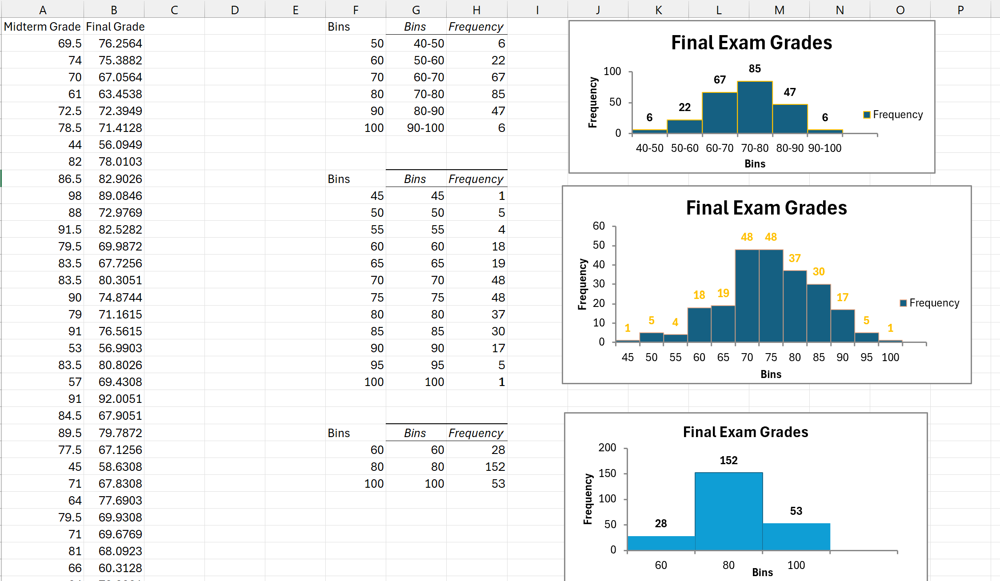

## Data Preparation -- Radiant
- read in `housing_raw.csv` into Radiant
### Step 1: Creating a new variable
- we will compute the age of the HDB flat in a new column, using the formula $age \: = year(month) \: - lease\_commence\_date$
	- extract the year from the date `month`
	- subtract the `lease_commence_date`
	- obtain the `age` variable and save it into a new column

```r
age = year(month) - lease_commence_date
```


### Step 2: Extracting the relevant variables
- Pick only a few other variables
	- `month` : date $\implies$ specifically zoom in on the Year 2021 only
	- `floor_area_sqm`: numeric
	- `age`: numeric
	


- use the syntax `<YYYY-MM-DD> ... <YYYY-MM-DD>` to filter records for the year 2021 only.


### Step 3: Saving the data
- store the data stored for later use and repeat to create `jan20tojun21.csv` as well


- save the data in the `Manage` pane


need to also Save the original `housing_raw.csv` file so that the `age` variable is populated using **"save data to type > to global workspace"**.

---
## Histograms -- Radiant
- Go to the `Visualize` tab
- Select the relevant variable (in this case, it is `age`)

### Using the GUI to create Histograms


### Use the CLI/Scripts to create Histograms
- use the pencil icon (**Report Results**) in the bottom left of the sidebar 

```r
# specifying the bin width
jan21tojun21 %>% # pass the whole dataset to the next function (i.e. ggplot)
ggplot(aes(x = age)) +
geom_histogram(breaks = seq(0, 54, by = 2), fill="orange", color="blue") +

# provide a title and override default labels for the plot
ggtitle("Age of HDB flats sold btwn Jan and Jun 2021") +
xlab("age of the flats") +
ylab("number of flats sold")
```


Interactive plot (using the `ggplotly` library)
```r
p =
jan21tojun21 %>% # pass the whole dataset to the next function (i.e. ggplot)
ggplot(aes(x = age)) +
geom_histogram(breaks = seq(0, 54, by = 2), fill="orange", color="blue") +

# provide a title and override default labels for the plot
ggtitle("Age of HDB flats sold btwn Jan and Jun 2021") +
xlab("age of the flats") +
ylab("number of flats sold")

ggplotly(p) %>% render()
```

---
## More Histograms in Radiant
- load in the dataset `exam_grades.csv`

- to make histograms with specific bin size, we need to use the **Report Results** panel again.


---
## Creating a Histogram in Excel
- Inserting a histogram into excel
- Right click the `x-axis` to adjust the bin sizes

Select the target column (i.e. `age` in this case) and then **Insert > Histogram**


### Adjusting the bin width and creating axis labels
- adjust the bin size by first **highlighting** the histogram and then **double-click** on the x-axis


- We can insert Axis Titles by using **Chart Design > Add Chart Element**


The resultant chart is shown as follows:


---
## Creating a Histogram using Analysis Toolpak
- Navigate to **Data > Data Analysis** to use the Analysis Toolpak in Excel
1. We also need to first specify the bin sizes (as shown below)


2. After selecting the data in the target column, check the checkbox **Labels** and then specify an output range (on the sheet itself) and also **check Chart Output**
	1. note that this is not the final result step we want yet because it looks more like a bar graph than a histogram.


**Double click** on the bars to bring up the *options menu*, where we set the following: 
- set gap width to **zero**
- delete the `More` Column (as not needed)




Can proceed to create these histograms as well
