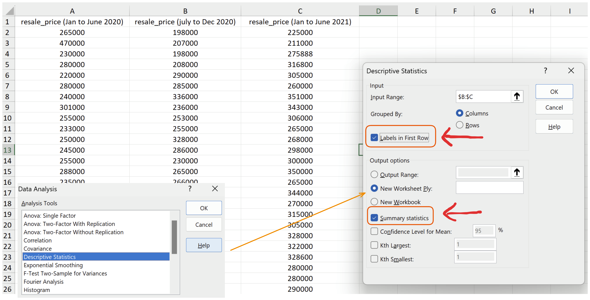
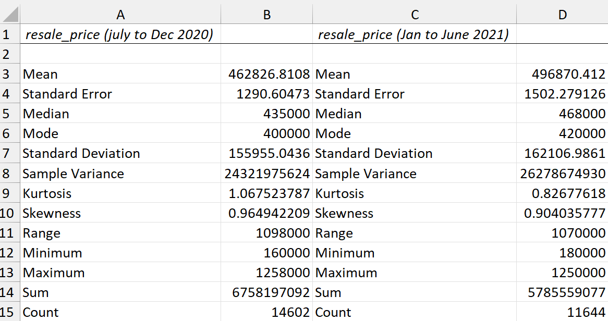
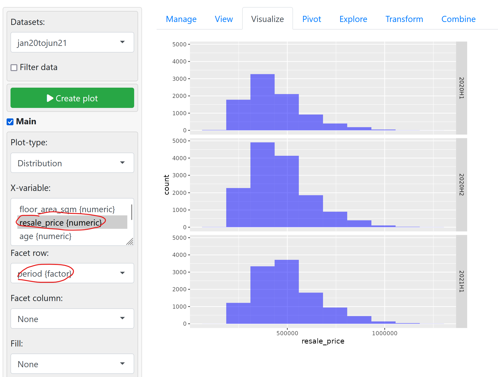
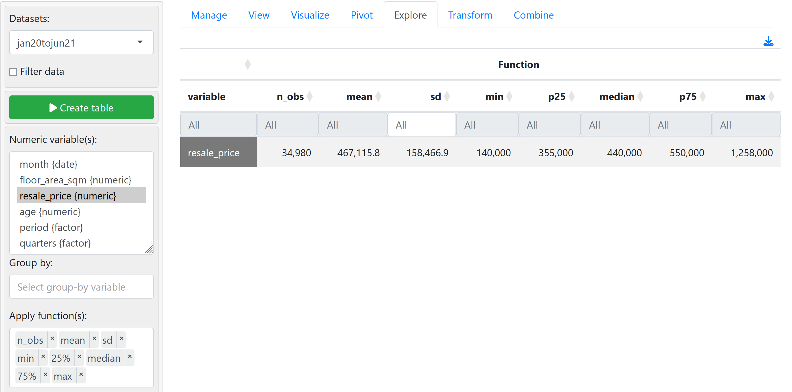
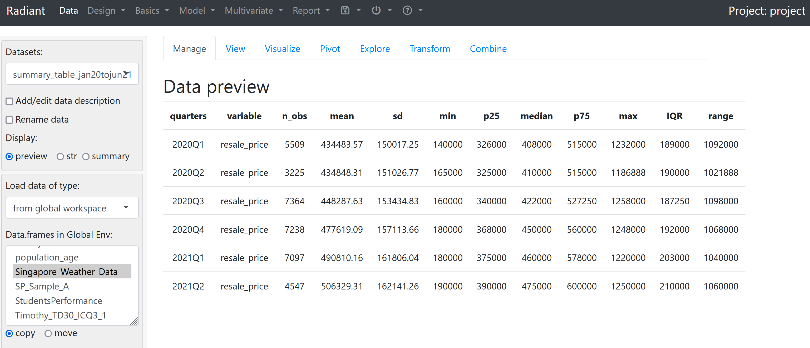

## 1. Excel
Utilizing the Analysis ToolPak
- use the `Descriptive Statistics` tool on the dropdown menu.

**Important Notes**
1. Make sure to **select "Labels in first row"** as the function expect numerical variables (should ignore the column labels in the first row)
2. Make sure to check `Summary Statistics`.


By default, the summary statistics are calculated and displayed on a new sheet.
- can also choose to display them inline with `Output range` toggle.



---
## 2. Radiant
Using the `jan20tojun21.csv` file that we created using radiant in Lab5a.

We need to create:
(i) a *new variable* to help us *partition the data into three distinct half-year periods*

**Using transform > create**

```r
period = cut(month, "6 months", labels = c("2020H1", "2020H2", "2021H1"))
```

and similarly 
(ii) *another variable to keep track of each quarter*
```r
quarters = cut(month, "3 months", labels = c("2020Q1", "2020Q2", "2020Q3", "2020Q4", "2021Q1", "2021Q2"))
```

We can create a histogram using **Visualize** and select the `x`-variable as `resale_price`, Facet row to be `period` (i.e. each half-year) and with the number of bins set to **10**.


### Computing Summary Statistics
- use the **Explore** tab.
- select `resale_price` and the functions to be applied (i.e. `mean`, `median`, first quartile / `25%` and third quartile / `75%`)



Group by quarters, save the new dataset and then create 2 new variables as below.
```r
# creating IQR
IQR = p75 - p25

# creating range
range = max - min
```




