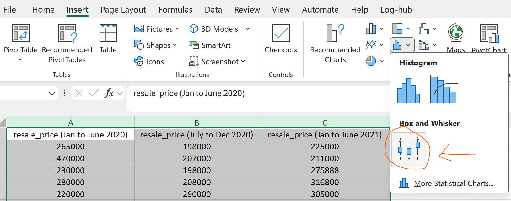

## 1. Excel

***Data Set:*** HDB Housing sale: `housing.csv`under `Prices Jan 2020 to Jun 2021`
1. Select all the data present
2. **Insert > Select Statistical > Box and Whisker Plot**

	

3. Modify the plot accordingly by adding legends and axes labels, you may also want to customize the border to make the markings in the whisker-plot more obvious.
	

	

---
## 2. Radiant
Using the `jan20tojun21.csv` file that we created using radiant in Lab5a.

We need to create:
(i) a *new variable* to help us *partition the data into three distinct half-year periods*

**Using transform > create**

```r
period = cut(month, "6 months", labels = c("2020H1", "2020H2", "2021H1"))
```

and similarly 
(ii) *another variable to keep track of each quarter*
```r
quarters = cut(month, "3 months", labels = c("2020Q1", "2020Q2", "2020Q3", "2020Q4", "2021Q1", "2021Q2"))
```

Next, we can use the **Visualize** tab to create the box plots.

X-Variable: `resale_price`
Y-Variable: `period`


Change the Y-variable to Quarter, select the Color as Quarter as well.


Make the plot interactive by using `Report Results` tab at the bottom (pencil icon).
- append the following:
```r
%>% ggplotly() %>% render()
```


