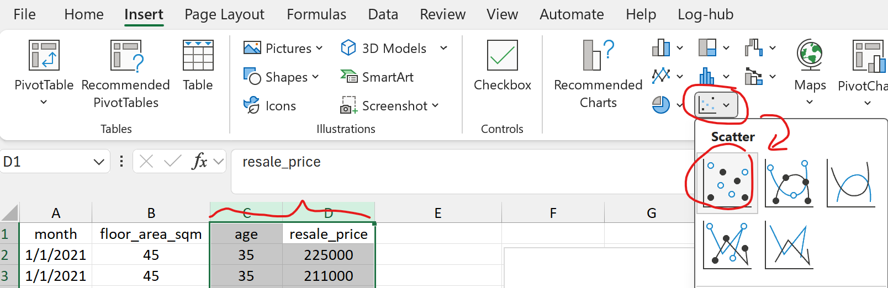
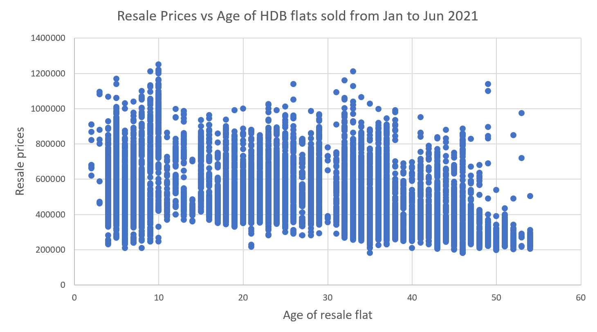
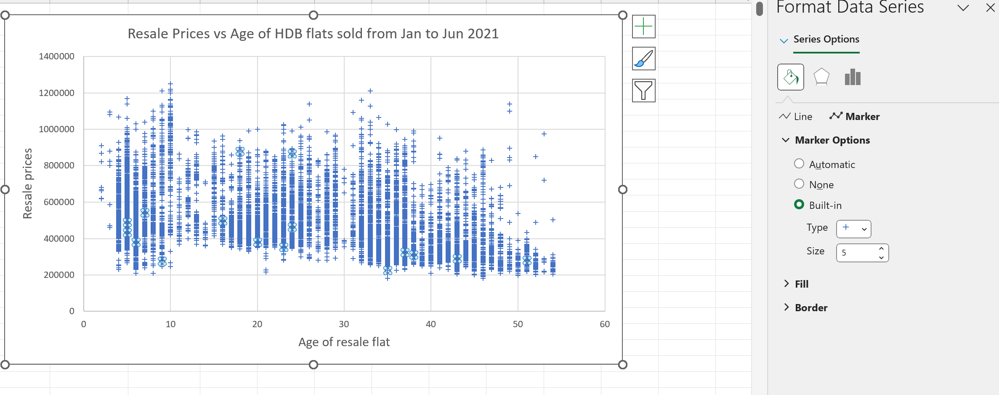
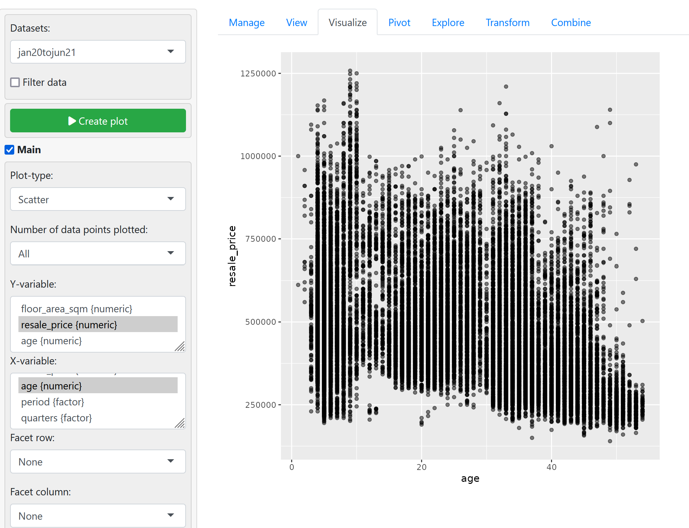
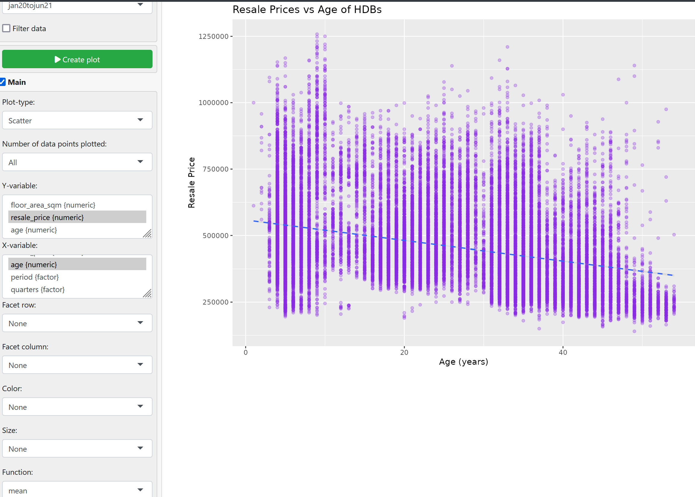

## 1. Excel
Make sure the independent variable is on the left side and the dependent variable is on the right side when selecting the columns.

1. Proceed to select *Scatter*

2. Add the title and corresponding axes labels using **Chart Design > Add Chart Element**

3. Right Click the scatter plot, go to **Format data series > fill > marker**
	1. Expand Marker Options and change the built-in **type** to cross "$+$"

---
## 2. Radiant

X-Variable: `age`
Y-Variable: `resale_price`

