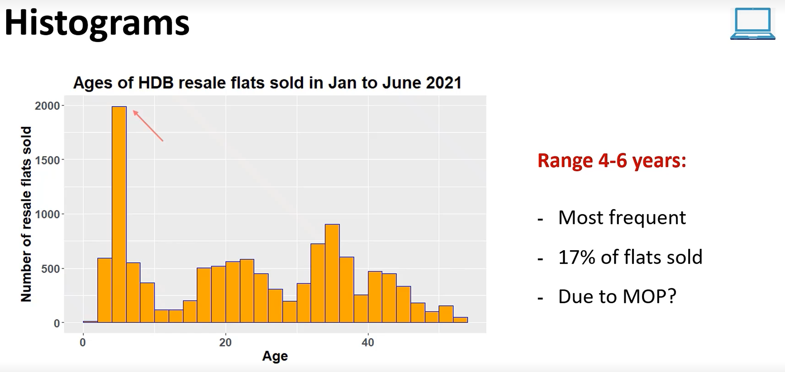
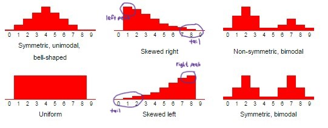
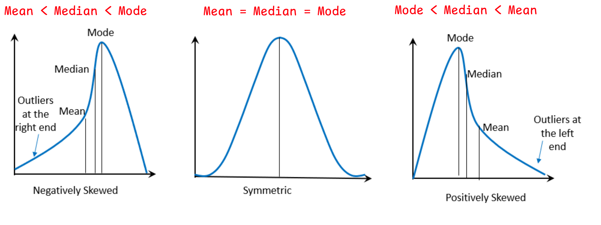
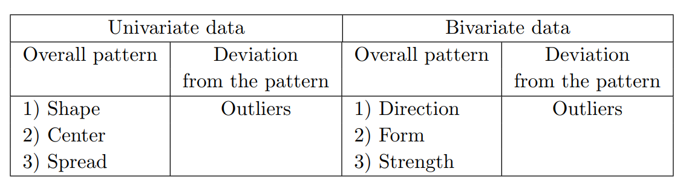

## A. Learning Outcomes and Key Concepts
- introduces EDA techniques and concepts for analyzing and interpreting numerical data

**What is Numerical Data?**
- It is data predominantly analyzed using regression analysis (regression is a major part of statistics)
- the chapter covers
	- univariate data analysis
	- bivariate data analysis - correlation of variables and related concepts

- Introduces Simple linear regression concepts 
	- how this technique is being used for real data sets

**Modelling or Plotting Numerical data**
- use of *histograms, boxplots and scatter plots*
- can be done for both univariate and bivariate data sets
---
## B. Motivation
- attempt to solve issue problem using real housing data collected in Singapore

- Dataset (`housing-raw.csv`): Sales of HDB Resale flat information between Jan 2017 to Jun 2021

**Problem: What factors may affect the popularity and pricing of resale flats sold in Singapore?**

**Plan: Narrow down the factors in the Problem state (by shortlisting)**
- Age? (of the resale flats at the point of sale)
- Floor Area?
- Time Period?

**Data: Clean and prepare the data**
- Remove irrelevant columns from 11 down to 4 in the cleaned dataset (have just `month`, `floor_area_sqm`, `age` and `relae_price` left)
- Filter the months to include just Jan to Jun 2021
- create the `age` column using calculation

---
## C. Univariate Data Analysis
> *def:* A **distribution** is an *orientation of data points* broken down by their observed number of frequency of occurrence.

can present / relate the variables `age` with its frequency (which can be called `freq_of_ages`) in a tabular form
- may not be very useful to see the patterns in the data
### Histogram
- graphical display of the distribution that organizes data points into **bins**
- provides a view of **data density** (higher bars = more common)

**Steps for Creation of the histogram plot**
- divide frequency table into smaller bins containing a range of values (i.e. distinct age counts of `2, 3, 4, 5, 6, 7, ...` become `0-2`, `2-4`, `4-6` etc.)
	- bins *exclude the lower end-point* and include the upper end-point of the interval

- Construct bars for each bin on the x-axis

- *deciding bin range*: often unclear and requires iterations
	- is an important factor since data gets grouped differently after adjusting the bin sizes and can affect our description/judgement based on the data
	- affects how we "estimate" the central tendency and skew of the distributions

**Considerations / Best practices**
- avoid histograms with **large bin widths** that group data to a limited number of bins (no variability in description of data)
	- loose interesting details
- avoid histograms with **small bin widths** that group data into too many bins (also affects one perception of distribution)
	- difficult to get an overall picture of the distribution
- may have to iterate over different bin sizes and see which is the most appropriate (based on ability to extract useful insights)

- don't confuse histograms with bar plots
	- one shows distribution across numerical bins/ranges while the other compares categories of the same variable
	- one has breakages or gaps while the other doesn't
	- numerical order doesn't matter for matter for bar plots but matters for histograms

	

**Advantages**
- presents the same info as a frequency table but is easier to understand
	- good for describing shapes of distributions
- useful for large(r) data sets $\implies$ impractical to show the value of individual observations

### Describing distributions
When graphing a distribution of a quantitative variable we look out for the:
- **Overall pattern** (Shape, Centre and Spread)
- **Deviations/Exceptions from the general pattern** (Outliers)

#### 1. Shape
We look out for the shape of the distributions via its *peaks and skewness* (a.k.a. descriptors)

#### Modality
Good to imagine a smooth curve outlining the distribution

**Types**
- unimodal distribution: have one distinct peak
- bimodal distribution: have two peaks
	- may indicate the presence of **two distinct groups**
- multimodal distribution: have multiple peaks
- uniform distribution: no apparent trend

**Characteristics of Unimodal/Bimodal distributions**

*Classifications*
- Symmetrical: Left and right halves are approximate mirror images, peak is in the centre
- Left-skewed: long left tail, peak to the right
- Right-skewed: long right tail, peak to the left

#### 2. Measures of Central Tendency (or centre)
- use mean, median and mode ad the measures of skewness to describe a distribution more precisely
- usual occurrence of mean median and mode below (usually $\underline{but \: not\: always}$)

#### 3. Spread
- **variability** of the distribution around their measures of central tendency using the measures of range and standard deviation
- "spread" across a wider range or higher frequency at the centre?

> *def:* the **range** of a data variable is the difference between the highest and lowest recorded data points
- may be misleading at times (give the wrong impression if we don't consider the distribution)

#### 4. Outliers
> *def:* Outliers are observations that fall **well above or well below** the overall bulk of the data
- use our judgement or more precise calculation/plotting methods (i.e. using a box plot computation)

**Why examine outliers?**
1. to identify strong skew in a distribution
2. for identifying possible data collection and/or entry errors
3. providing interesting insights to the data

**Key considerations**
- mean may be affected as a result of outliers such that it **does not stand a good measure** of central tendency
- median and mode are called **robust statistics** (since outliers don't have effects on these)
	- robust to extreme observations (i.e. outliers) $\implies$ values at the endpoints are irrelevant to its calculation
- standard deviation may indicate the spread of value and hence may change drastically if there are many outliers

- may be worth repeating data analysis twice (to evaluate/provide some justifications to whether they should be dropped)
	- with outliers
	- without outliers (with them removed) $\implies$ should not be removed unnecessarily and may be a naive approach

- don't remove outliers if they have minimal effect on conclusions $\implies$ need to have good justifications to remove

### Boxplots
- use a five-number summary to construct the box plot
	- Minimum (Q0)
	- Quartile 1 (Q1)
	- Median (Q2)
	- Quartile 3 (Q3)
	- Maximum (Q4)

- $IQR$ is calculated using $Q3 - Q1$
	- find the **median** and then the median of upper and lower halves 
	- computation of quartiles also differ in Excel (use a different computational algorithm)

#### Outlier definition in terms of statistics used
outlier is valid if it meets one of the two conditions:
$outlier  \gt Q3 + (1.5 \times IQR) \lor outlier \lt Q1 - (1.5 \times IQR)$

#### Steps in constructing box plots
1. Draw a box from Q1 to Q3
2. Draw a vertical line in the box where the median is *(also can be labelled as Q2)*
3. Draw lines touching the box, as per the specifications below (a.k.a. *whiskers*)
	1. Extend a line from Q1 to the smallest value that is not an outlier (i.e. $value \geq Q1 - 1.5 \cdot IQR$)
	2. Extend the line also from Q3 to the largest value that is not an outlier (i.e. $value \leq Q3 - 1.5 \cdot IQR$)
4. Indicate outlier points with **dots** (using the considerations above).
5. Add the mean (indicated by $X$ on the box plot), if necessary.
	1. can be added in excel

#### Describing Boxplots
- can obtain the "shape" of the plot
	- comparing the variability in the *upper versus lower halves* (i.e. below and above the median value) $\implies$ useful of **highlighting outliers, median & IQR**
	- i.e. is it right or left skewed, or is it a normal distribution?
	
- the **centre (median) is prominently shown** in a boxplot $\implies$ can compute relative positions of median to mean and determine if the distribution is left-skewed, right-skewed or normal etc.

- looking at the **spread**: not really meaningful on its own (need some basis of comparison)
	- are there many outliers? where do the outliers lie (nearer to Quartile 3??)
	- look at the trends over different time periods (by comparing box plots)

### Histograms versus Boxplots
- Histogram provide a better sense of the **shape** of the distribution variable, especially when great differences in the frequencies in data points
- Boxplots are more useful
	- when comparing distributions of different datasets (of the same category to draw some conclusion $\implies$ trends)
	- identify and exhibit outliers clearly (dots are very apparent)
- Boxplots don't give information with how many data points there are *while histograms are able to show the frequencies*

---
## D. Bivariate Data Analysis
- use analytical techniques to answer questions investigating relationships
- two-variable data (i.e. using two columns)
	- use other forms of visualization to pick up patterns

Can be done through a $\underline{combination}$ of
1. Scatter Plots - give idea of the pattern
2. combined with Correlation Coefficients - checks for linear r/s
3. Regression Analysis - fit a line or curve to the data
### Deterministic Relationships
> *def:* the value of one variable can be **determined exactly** if we know the value of the other variable in question. (and probably the function of computation, $f\:$)
- commonly represented by straight lines on a plot
	- i.e. Fahrenheit-Celsius conversion or Meter-Feet conversion

### Non-deterministic Relationships
- is the main focus of this section
- often not possible for a statistical or non-deterministic relationship to find or approximate the value of one variable given another (i.e. not predictable)
	- associative relationship is used instead to describe how entities are linked to each other
### Association between two variables
- natural variability exists in measurements of two variables
- average value of one of the variable can be described based on the value of the other variable
### Scatter plots
- use if data points are patchy (lots of data)
- if not sure which is the independent and which is the dependent variable, then arbitrarily choose both

#### Describing Scatter Plots
when describing these plots overall pattern, we use a combination of:
- Direction
	- **Positive** Relationship: ↑ indep, ↑ dep variable (↑ explanatory, ↑ response)
	- **Negative** Relationship: ↑ indep, ↓ dep variable
- Form
	- its general shape (linear or non-linear/curve patterns) $\implies$ linear if it appear to scatter around a straight line
- Strength
	- description of ***how closely*** data follows the form (as described above)
	- do points deviate from the best fit curve or line?

*i.e. Positive Linear relationship or Negative Non-linear relationship*

and for deviations, we look at **outliers**
