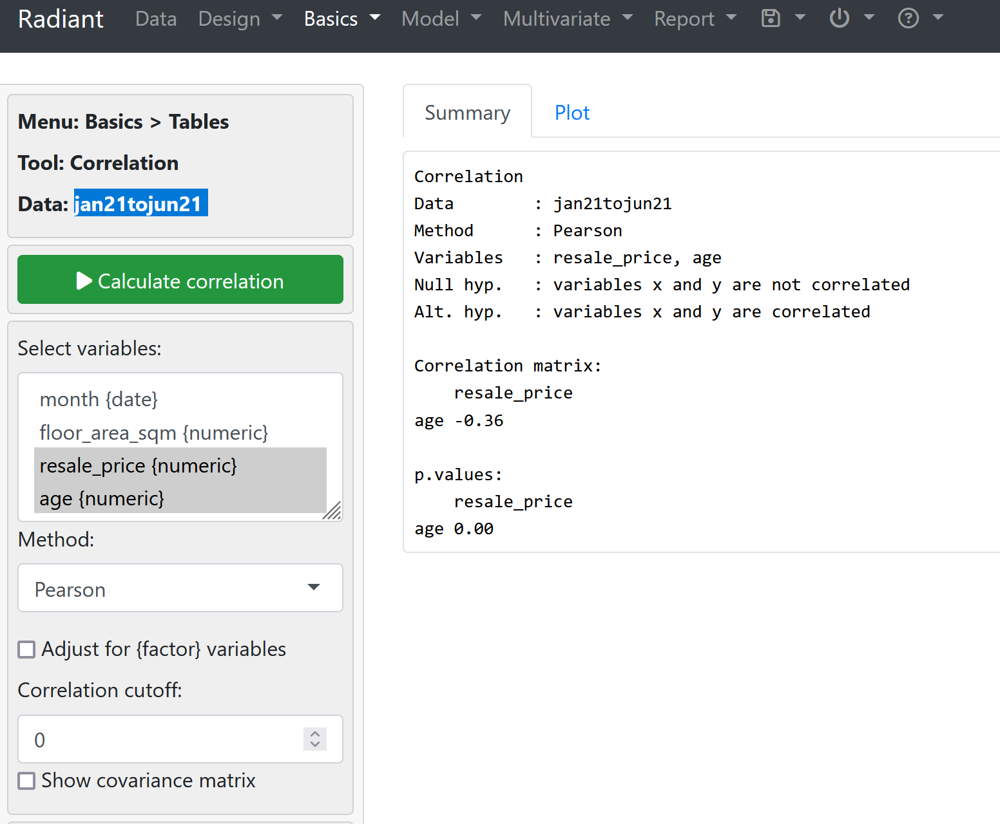
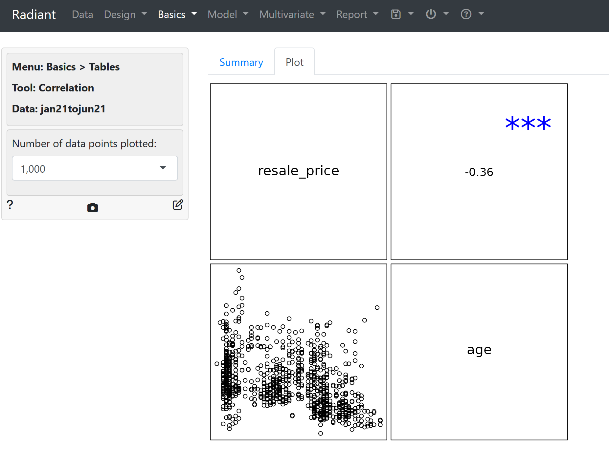
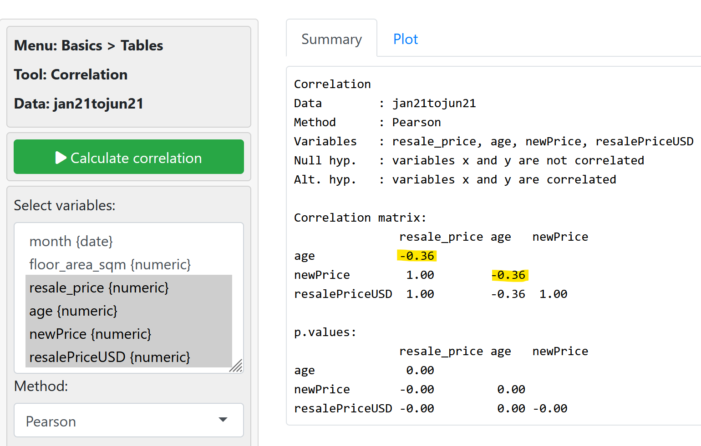
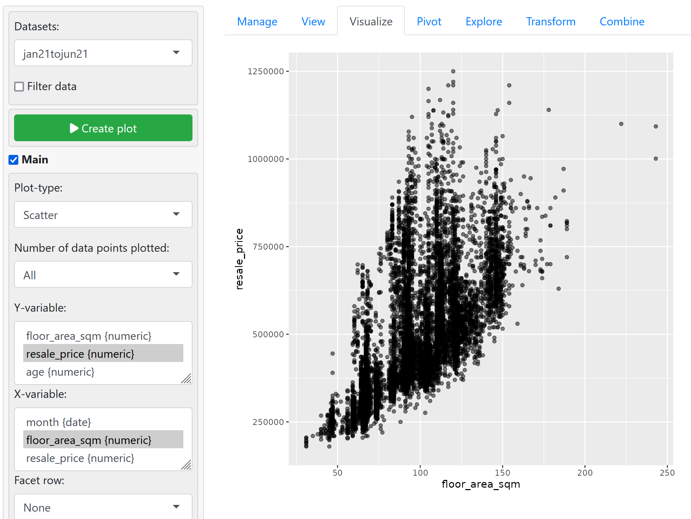
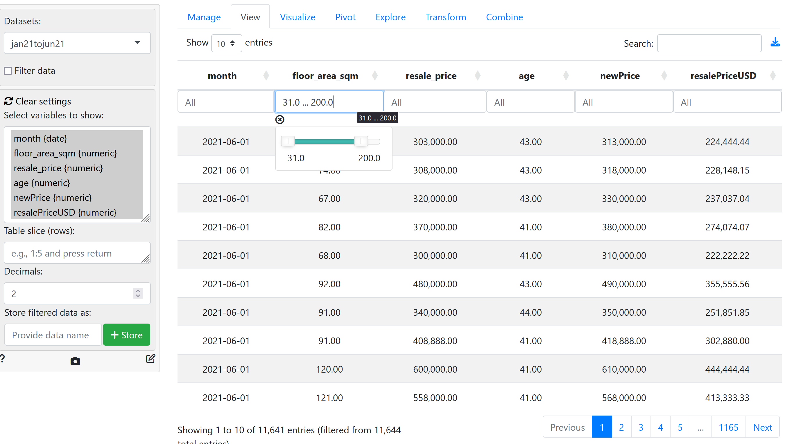
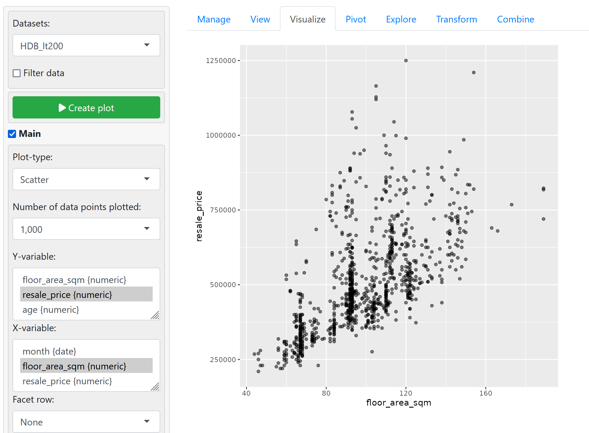
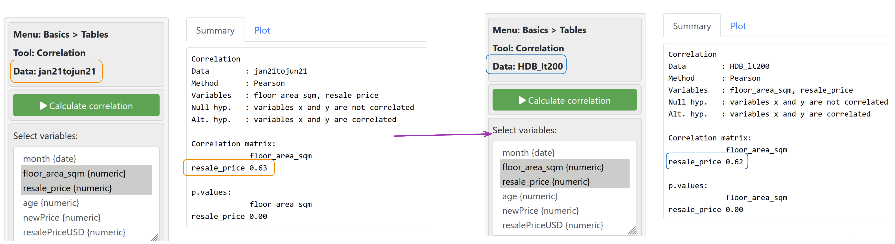

To compute Correlation Coefficient use **Radiant > Basics > Correlation**



Navigate to the **Plot** tab to view the same results in another form.


## Transforming the data 
- we want to see the effect on $r$ after transforming the data.

1. Navigate to **Data > Transform > Create**

2. create the following variables
```r
newPrice = resale_price + 10000;
resalePriceUSD = resale_price / 1.35;
```

After transforming the data, we can navigate back to **Correlation** and we observe that
- the value of the correlation coefficient $r$ has not changed after the transformations (addition and multiplication do NOT affect the $r$ value).


## Comparing Correlation Coefficients

Plot the follow Scatter Plot using the **Visualize** tab
Type: `Scatter`
No. of Data Points: `All`
X-Variable: `floor_area_sqm`
Y-Variable: `resale_price`




Can further filter out values beyond 200 sqm using the **View** tab. Then save the filtered data as `HDB_lt200`.


Use the scatter plot to visualize the filtered data set, this time by selecting `HDB_lt200`.



We can then compare the correlation coefficients (original data set versus one with floor area upper bounded to `200` sqm)
