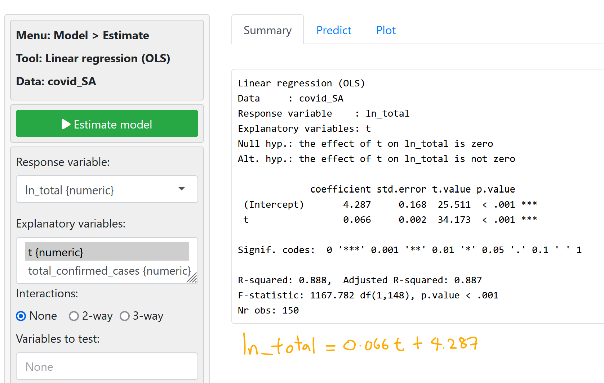

Using the `jan21tojun21.csv` dataset again.


Proceed to **Model > Linear regression (OLS)*


---
## SLR after Log Transformation
- using the `covid-SA.csv` dataset.

X-Variable: `t`
Y-Variable: `total_confirmed_cases` *(⚠️ make sure to rename before you import the csv file!)*

*Add the line of best fit* by checking the **Line** checkbox on the menu bar.


We observe from the above that the curve is non-linear, thus the best-fit line is not a good representation. To remediate this, we will "normalize" all values using the natural log function (`ln`).

Create a new variable using the following formula:
```r
ln_total = ln(total_confirmed_cases)
```
store the new variable in the dataset.


Proceed back to the Visualize tab to plot:
X-Variable: `t`
Y-Variable: `ln_total`


