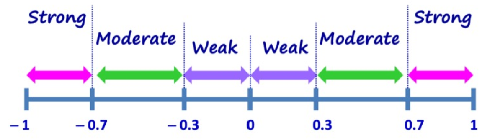
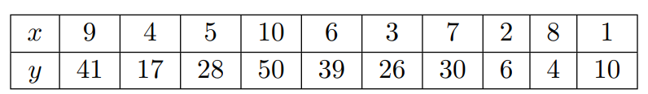
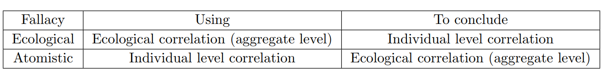
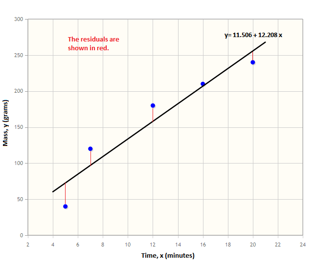
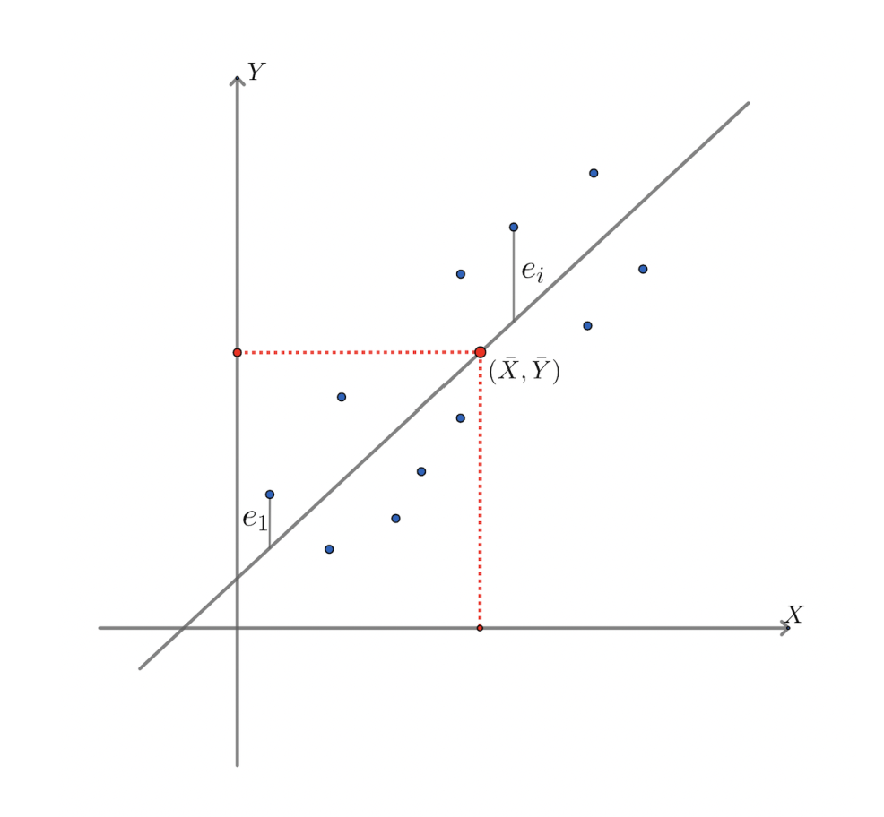

## A. Correlation Coefficients and its Limitations

### Motivations
- how to determine the strength of a relationship? *Strong or Weak?*
	- how do we measure the relationship quantitatively

### The Correlation Coefficient
> *def*: Correlation Coefficient, denoted by $r$, is a measure of linear association between them
- summarizes the direction and strength of the association (ranging from `-1` to `1`)

#### Interpreting the `r`-value
- the **sign** tells us the **direction** of the linear association, `+` for positive, `-` for negative and `0` for no linear association.
- the **magnitude of $r$**  determines the **strength** of the linear association btwn two numerical variables
- **perfect linear association** occurs when all the data points line on the line of best fit

- $r \gt 0 \implies$ positive linear association
- $r \lt 0 \implies$ negative linear association
- $r = 1 \implies$ perfect positive linear association
- $r = -1 \implies$ perfect negative linear association
- $r = 0 \implies$ no linear association

Magnitude of `r` tells us about the strength of the linear association
- closer the `r`-value to either -1 or 1, then the stronger the linear association
- closer the `r`-value to 0, then the weaker the linear association

#### Computation of Correlation Coefficient
Formulae:
$$
Standard\: Unit_x = \frac{x - \bar{x}}{\sigma_x}
$$

$$
Standard\: Unit_y = \frac{y - \bar{y}}{\sigma_y}
$$
**Steps:**
1. Compute mean and S.D. of $x$ ($\bar{x}$ and $\sigma_x$) as well as mean and S.D. of $y$ ($\bar{y}$ and $\sigma_y$) 

$$
\begin{aligned}
\bar{x} = \frac{9 + 4 + 5 + 10 + 6 + 3 + 7 + 2 + 8 + 1}{10}
\newline\newline
= 5.5
\end{aligned}
$$

$$
\begin{aligned}
\sigma_x = \sqrt{\frac{(9 - 5.5)^2 + (4 - 5.5)^2 + ... + (1 - 5.5)^2}{10}}
\newline\newline
= 2.87
\end{aligned}
$$

$$
\begin{aligned}
\bar{y} = \frac{41 + 17 + ... + 10}{10}
\newline\newline
= 25.1
\end{aligned}
$$
$$\begin{aligned}
\sigma_y = \sqrt{\frac{(41 - 25.1)^2 + (17 - 25.1)^2 + ... + (10 - 25.1)^2}{10}}
\newline\newline
= 14.84
\end{aligned}
$$

2. Compute $x$ and $y$ in their standard units for each data point, i.e. 

$$
SU_{x1} = \frac{9 - 5.5}{2.87} = 1.22 (2\:\: d.p.)
$$
3. Compute $SU_{x \: \cdot \: y}$ based on Step 2.
4. Compute $r$ (sum the products obtained by $SU_x$ and $SU_y \:$)

$$
r = \frac{1}{N} \cdot \bigg(SU_{x1\:y1} + SU_{x2\:y2} + ... SU_{xN\:yN}\bigg)
$$
#### Important Properties of the Correlation Coefficient `r`
- `r` is not affected by interchanging the $x$ and $y$ variables
- if we $\underline{\textbf{add}}$ *(or conversely subtract)* a constant $k$ to $\underline{all\: data\: points}$ (supposing input error), it **does not affect** the value of `r`
- if we $\underline{\textbf{multiply}}$ a constant $m$ to $\underline{all\: data\: points}$ (supposing conversion or "shifting" by a certain factor $m$), the value of $r$ remains unaffected.

### Disadvantages of using Correlation Coefficient
1. Association is not causation.
	- there is often a strong association btwn variables (i.e. $r \to 1$ or $r \to -1$) which is misinterpreted as a cause-effect r/s 
	- remember that statistical relationship $\ne$ causal relationship

2. The correlation coefficient cannot tell us anything about non-linear relationships
	- `r` does not apply for non-linear r/s since it does not give indications if variables are related non-linearly.

3. outliers may increase the **strength** ("closeness" to best fit) of the correlation coefficients
	- removal of outliers from the data set can have different effects on `r`!

### Ecological Correlations
- correlation based on aggregated "groups" at different points of the graph

**Disadvantage**
- may overstate the strength of associations individuals **despite being in the same direction** as aggregates

> *def:* **Ecological fallacy** occurs when one draws a false conclusion about correlation at the individual level (the big picture) based on what was observed at the aggregate level

> *def:* **Atomistic fallacy** occurs when one mistakenly concludes that the same correlation observed at the individual level would also exist at the aggregate level.

---
## B. Linear Regression
- used to "guess" some variable some time down the road through extrapolation
- should not use regression line to predict values outside of the range of $x$.

Linear Association Formula:
$$Y = mX + b$$

- $b \to$ y intercept; $m \to$ gradient 

#### Residuals
- "error" of the $i_{th}$ observation
	- formula: $e_i = y_i - \hat{y_i}$
	

### Assessing Best Fit Lines
**Method of Least Squares** regression line- makes use of residuals

$$
e_k = {e_1}^2 +{e_2}^2 + ... + {e_n}^2  = \sum_{i=1}^k (e_i)^2
$$

- Notes:
	- will always pass through point of averages (i.e. $\bar{x},\:\bar{y}$)
	- allows us to predict average resale price for a given age of a resale flat (but NOT vice versa) $\implies$ two regression lines (`price`/`age` and `age`/`price` are not interchangeable!)

#### Gradient of the regression line
Gradient is closely related to correlation coefficient $r$.

$$
m = \frac{\sigma_y}{\sigma_x} \cdot r
$$

- Gradient is the quotient of S.D. of $y$ divided by S.D. of $x$ multiply by $r$.
- $m$ may not equate to $r$
- when $r$ is positive, then $m$ is also positive $\to r_+ \implies m_+$ and  $r_- \implies m_-$ (vice versa)

---
## C. Studying non-linear relationships
- use a combination of correlation coefficient + scatter plot (for bivariate data) to test for non-linear relationships
	- show a **clear visual** of exponentiation or a quadratic / cubic function to disprove linearity and hence linear relationship between variables
