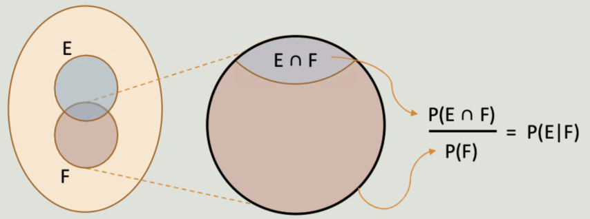

# Week 7 Lecture Notes

## A. Background and Motivation
The Plan, Data and Analysis Phases of PPDAC involved the use of specialized tools and techniques to inter-relate these three phases.

> *def:* Statistical Inference is the process of drawing conclusions from sample data.
### Key Learning Outcomes
- concepts of basic probability theory (condition probability), independent and mutually exclusive events, discrete and continuous random variables
- prosecutor's fallacy, base rate fallacy and conjunction fallacy
- statistical inference using
	- confidence intervals
	- hypothesis tests
### The Analysis Phase of PPDAC
- use of Summary Statistics (Chp 1)
- analysis of categorical variables using rates, rules of rates etc. (Chp 2)
- analysis of numerical variables using the correlation coefficient, visualizations and five-point summary stats (Chp 3)

---
## B. Introduction to Probability
**Uncertainty**
- use `"chance"` to mean that something is indefinite or not certain to occur
- when comparing likelihood of occurrence, we use terms like `more or less likely` $\implies$ common for everyday use but not precise when we deal with data @ a deeper level (need some concrete way of defining uncertainty)

> *def:* Probability is a mathematical means to reason about uncertainty.

### Classic Problem and Motivation
- determine the possible outcomes and "likelihood" of the side where a coin lands after two tosses
	$$Set(Outcomes) = sample\_space =  \{HH, HT, TH, TT\}$$

> *def:* A Probability Experiment is any procedure that can be **infinitely repeated** and has a well-defined, **precise set of outcomes**.

- probability experiment must be repeatable

> *def:* A **sample space** is the collection of *all possible outcomes* of a probability experiment *(see above)*
- an event is a group of element(s) / sub-collection of the sample space
$$
Event_1 = HT
$$
$$
Event_2 = HT, TH, TT
$$

> For a probability experiment with an associated sample space, the *probability of an event* of the sample space is the total probability that the outcome of the experiment is an element of the event.

$$
\begin{aligned}
Event_n \subset \mathcal{E} 
\newline \newline
\{2, 4, 5\} \subset Set(Dice \: rolls)
\end{aligned}
$$
### Probability of an Event, `P(E)`

The probability of Event $E$, denoted $P(E)$ takes on a numerical value between *zero and one* inclusive $\implies \: 0 \le P(E) \le 1$ .
- note that $P(E)$ should be the **long-run proportion** of observing $E$ with many repetitions (i.e. $N$, which is also called the sample space).
- $P(E)$ is estimated using the following formula
		$$
			P(E) = \frac{count(E)}{N}
		$$

- $P(E) = 0$ *iff* $E$ is an impossible event
- $P(E) = 1$ *iff* $E$ is a certain event

**Important Notes**
1. The estimate of $P(E)$ obtained from $N$ repetitions is likely to be **different**, if we repeat the experiment (and get estimate of $P(E)\:$) another $N$ times.

2. Such estimates of $P(E)$ get more accurate and closer to the actual true $P(E)$ value as $N$ becomes larger. 

### Rules of Probabilities
- Virtually impossible to verify the true probability of an event for a given probability experiment
- $\therefore\:$ sufficient to just provide estimates as if it were the true probability

- need to ensure that some rules are observed
1. The probability of each event $E$, denoted $P(E)$, is a number between 0 and 1 inclusive.
2. If we denote the entire sample space by $S$, then $P(S)$ is 1.
3. If $E$ and $F$ are mutually exclusive events (can't happen simultaneously), then $P(E \cup F) = P(E) + P(F)$

We will stick to assumption that the sample space contains only a finite number of outcomes.

### Uniform Probability
> *def:* **Uniform probability** is the way of assigning probabilities to outcomes such that **equal probability** is assigned to *every outcome* in the *finite sample space*. Thus, if the sample space contains a total of $N$ different outcomes, then the probability assigned to each outcome is $\frac{1}{N}$.

- probability of selected any particular unit in this case if $\frac{1}{N}$
 - the sampling frame is exactly the sample space of the uniform probability experiment

---
## C. Prosecutor's Fallacy
- expert witness in dual-murder case (of children) commented that the chance of two children from an affluent family dying from Sudden Infant Death Syndrome is 1 in 73 million.
	- $\implies$ later on the Royal Statistics Society decided to issue a public statement of how this probability calculated was misrepresented
	- expert witness assumed that first child's death and second child's death are independent of each other
		- used the formula $P(First \: infant \: death | Clark \: innocent) \times P(Second \:infant \:death | Clark \: innocent)$ when they might in fact be related

- occurs when we assume that $P(A \: | B)  = P(B \: | A)$ ❌
	- "all cows have four legs" does not imply "all four legged animals are cows"

### Conditional Probability
> *def:* Conditional probability is the probability of one even given another event, where both events are of the same sample space

- Probability of Event E given F, $P(E \:| F)$ 
	- Computation is based on restricting the focus of the given event F as the **restricted sample space** (rather than the entire sample space $N$)
	- Events $F$ and $E$ *may or may not have overlaps* which are denoted as $E \cap F$

$$
P(E \: | F) = \frac{P(E \cap F)}{P(F)}
$$
**Cases where Conditional Probability is zero**
1. If $P(E \cap F)$ is zero, it indicates that $E$ and $F$ **do not happen simultaneously**. In this case, $P(E \: | F)$ is also zero.
2. If event $F$ itself cannot occur (i.e. $P(F) = 0$) $\implies$ $P(E \: | F) = 0$, provided $E$ and $F$ are in the same sample space.

#### Conditional Probabilities as rates
Rates and Conditional probability are related by the equation:
$$
P(A \: | B) = \frac{P(A \cap B)}{P(B)} = rate(A \: | B) 
$$

### Independent Events
> *def:* The probability of an Event A is the same as the probability of A given B. So the fact that B has not occurred does not affect the probability of A occurring.
$$
P(A) = P(A \: | B)
$$

Conditional probability with A and B being independent from each other:
$$
P(A \: | B) = \frac{P(A \cap B)}{P(B)}, P(A) = \frac{P(A \cap B)}{P(B)} \implies P(A) \times P(B) = P(A \cap B)
$$
Recall: We say that two variables are not related if $rate(A) = rate(A \: | B)$.
- Thus, A and B are independent events whenever they are **not associated** with one another.

#### Conditional Independence
- Two events A & B are conditionally independent given an Event C with $P(C) > 0)$ if:
$$
P(A \cap B \: | \:C) = P(A \: | \: C) \times P(B \: | \: C)
$$
- using the "distributive" technique

---
## D. Conjunction Fallacy
> *def:* The *law of total probability* states that if $E$, $F$ and $G$ are events from the same sample space $S$ such that
> 	1. $E$ and $F$ are mutually exclusive (i.e. $E \cap F = \emptyset$)
> 	2. $E \cup F = S$
> 	Then, $P(G) = P(G | E) \times P(E) + P(G | F) \times P(F)$

> *def:* **Conjunction fallacy** occurs when one believes that the chances of two things happening together is higher than the chance of one of the two things happening alone.

i.e. Assuming 
$$
P(A \cap B) \gt P(A) \: or \: P(B \cap A) \gt P(B)
$$

when in actuality:
$$
P(A \cap B) \le P(A) \: or \: P(B \cap A) \le P(B)
$$

---
## E. Base Rate Fallacy
> *def:* The **base rate fallacy** is a decision-making error in which the information about the rate of the occurrence of some trait in a population, called the base rate information, is ignored or not given appropriate weight.

Example case study: Accuracy of ART Test Kits
1. Scenario 1: Infected Individual's ART result is positive
	1. True Positive Rate / **Sensitivity of the Test**: $P(Tests\: Positive | Individual\: is\: infected)$
	
2. Scenario 2: Infected Individual's ART result is negative
	
3. Scenario 3: Healthy Individual's ART result is positive
	
4. Scenario 4: Healthy Individual's ART result is negative
	1. True Negative Rate / **Specificity of the Test**: $P(Tests\: Negative | Individual\: is\: not \: infected)$

Results from scenario 1 and 2 are not helpful for the average layman (don't actually have the means to afford testing options which 100% confirm diagnosis), thus more useful to find out:
$$
P(Individual\: is\: infected \: | \: Tests\: Positive)
$$

Apart from the **sensitivity (TP rate)** and **specificity (TN rate)**, it is also important to consider the **base rate of infection** of the population.
- Base rate: is the basic probability of a particular event without any conditional probability

---
## F. Random variables
> *def:* A **random variable** is a **numerical** variable with probabilities assigned to *each of the possible* numerical values taken by the numerical variable (i.e. rolling a dice.
- applies to both discrete and continuous random variables
- The mode of a discrete random variable is the value of x that attains the highest y-value.

#### Discrete Random variables
Example of probabilities involved when rolling an **unequal six-sided die** might be as follows:
$$
\begin{aligned}
P(Y = 1) = \frac{1}{3}
\newline
\newline
P(Y = 2) = \frac{1}{3}
\newline
\newline
P(Y = 3) = \frac{1}{12}
\newline
\newline
...
\newline
\newline
P(Y = 6) = \frac{1}{12}
\end{aligned}
$$
$$
\therefore \: \sum_{i = 1}^{6} P(Y = i) = 1
$$

Example 2 (Tutorial 4 Qn 1)

#### Continuous Random variables
- continuous random is defined over an interval of values and is represented by the area under the **density curve**

$$
P(a \le Y \le b) = \int_a^b f(x) dx \:, \: on \:  [a, b]
$$

