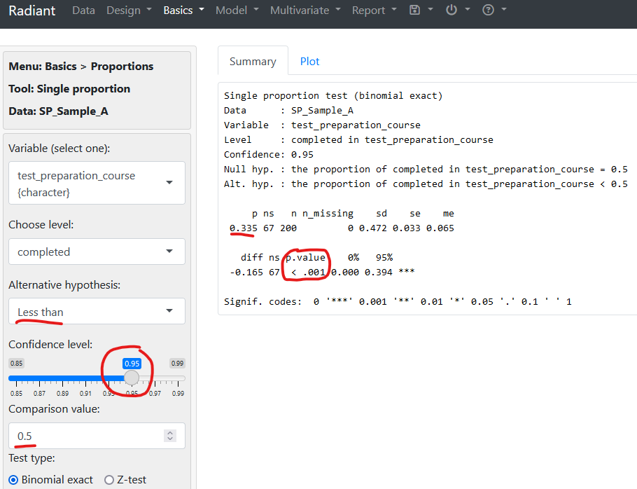
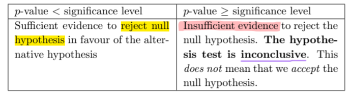
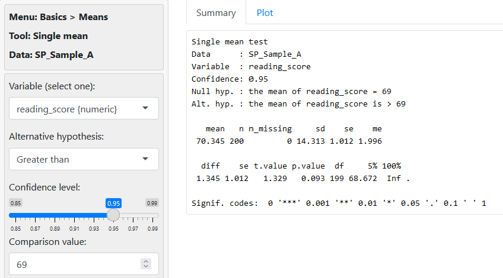
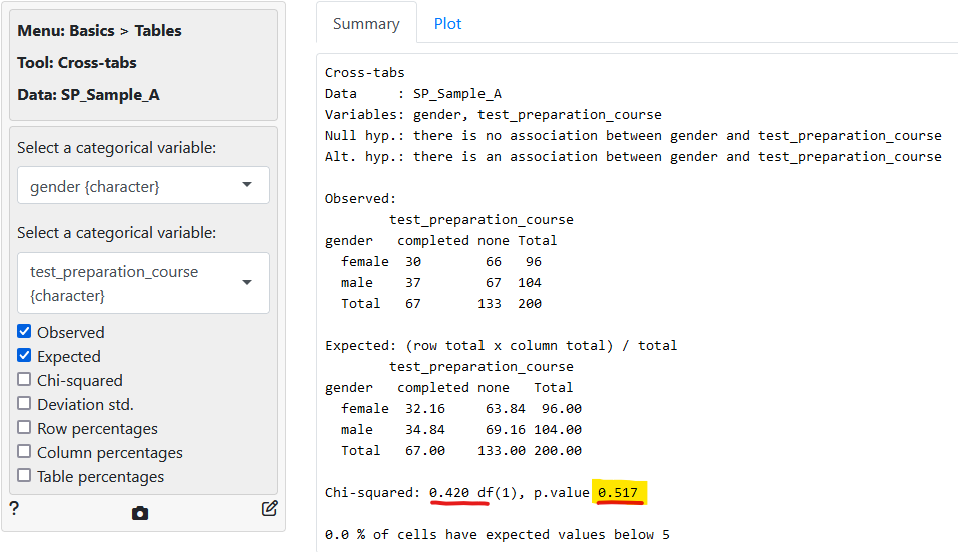

## A. Overview and Learning Objectives
- understand confidence intervals and how it is used to
	- derive an interval estimate
	- understand unknown population parameters (population proportion and mean)

- understand the 4 key steps in hypothesis testing

- apply hypothesis testing in carrying out the chi-squared test and the one-sample t-test
---
## B. Statistical Inference
Important to have well-defined generalisability criteria when conducting sampling $\implies$ is the result of the study representative of the population of the sample?

- sample statistics are subject to inaccuracies (*bias* of researchers / respondents + *random error*)
	- but want to **minimize these inaccuracies** to be as close as possible to *population parameter* $\implies$ which is what we wish to ideally obtain
```python
Sample Statistic = population parameter + bias + random error
```

1. Need to know the **survey methodology** used to generate the sample
2. Need to also know the **statistical methods** used to infer finding(s) from the target population in question.
	1. can statistics from the sample level be generalised / lead to similar conclusions at the population level?

**Methods to reduce bias (recap)**
1. Good Sampling Frame $\to$ zero selection bias
2. Use of probability-based sampling methods $\to$ zero selection bias
3. 100% response rate $\to$ zero non-response bias

> *def:* **Statistical inference** refers to the use of samples to draw **inferences or conclusions** about the population in question.

After EDA is completed, for a given sample, we need to cycle between:
1. Generating Questions
2. Visualization and Analysis of the variables in question
3. Answer Questions and if needed, refine them (fed back into point 1)

#### Advantages of Sample versus Census
1. **Cost:** census requires measurement of every unit in the population 
	1. costly, have a chance of missing out certain groups
	2. very resource intensive

2. **Feasibility:** Instead of taking a small portion for "experiment", require to take everything (i.e. go overboard)
	1. example: Doctor needing to take all of a patient's blood for blood test instead of a small sample

### Rule of Inference
> *def:* The *Fundamental Rule of Inference* states that available data can be used to make inferences about a much larger group if the data can be considered to be representative with regards to the question of interest.

- by adopting good sampling methods and good practices (i.e. having a good sampling frame), we can **greatly reduce selection bias** to be insignificant (i.e. selection bias $\implies$ 0).

- random error refers to the small differences arising as a result of *sample variability* when using any probability-based sampling method.

### Confidence Interval
> *def:* A **confidence interval** is the range of values that is likely to contain a population parameter based on a certain degree of confidence.
- range of values in which the *true mean* may fall within 
- allows sampling variability to be taken into consideration

- degree of confidence is
	- represented as a percentage (%)
	- termed as the confidence level (which is typically 95% or 99%)
	- refers to the long-run reliability of the method used to construct the interval (via repeated sampling)

Focus is on the construction of *confidence intervals* for the **population proportion and mean.**
- we consider `flat_type` variable in the HDB resale dataset $\implies$ indicates the type of HDB resale flat (i.e. 1-room, 2-room ... 5-room, executive, multi-generational)

Formulas:
$$
Raw \: Population\: Proportion_{i} = \frac{Frequency\:(i)}{Total  \: Frequency}
$$

$$
Actual\: Population \: Proportion_i = Raw \: Population\: Proportion_{i} \: \pm \: random \: error
$$
- *Note:* random error could be negative.


#### Confidence Interval Formula
$$
CI = p^* \pm z^* \times \sqrt{\frac{p^*(1-p^*)}{n}}
$$
$p^*$   =   sample proportion
$z^*$   =   z value from standard normal distribution (provides the lower and upper limits)
$n$   =   sample size
The $z^* \times \sqrt{\frac{p^*(1-p^*)}{n}}$ is known as the margin of *error* which impacts the **width** of the confidence interval

$\sqrt{\frac{p^*(1-p^*)}{n}}$ is the standard deviation of standard error.


**Common Mistake**
Claim that there is a 95% chance that the population proportion of a 5-room resale HDB flat lies between 0.235 and 0.273.
1. Not correct because the **population proportion $p$ is fixed**, does not vary $\implies$ no probabilistic element in what the proportion is going to be
	1. $p$ is either (a) INSIDE the interval or (b) NOT INSIDE the interval
2. For a particular sample, the confidence interval constructed only depends on the sample proportion and the corresponding $z^*$ value and therefore the $CI$ is also "**fixed**" and there is no probabilistic element to it

#### Properties of Confidence Intervals
1. When a sample is taken with *the same sampling frame, sample sampling method (SRS)* but **smaller sample size**
	1. The resultant $CI$ will be **larger** than the one with the larger sample size
	2. Larger Sample size = Smaller Random Error (Margin)

	

2. **Confidence Level** impacts the confidence intervals
	1. i.e. Confidence level of 90% vs 95% affects the $z^*$ value and hence the overall computation of the confidence interval.
		- $z^*$ for 95% is `1.96`
		- $z^*$ for 90% is `1.645`
	2. Lower $z^*$ value results in a *narrower interval*

### Population Mean $\mu$ Formula
$$
\mu = \bar{x} \pm t^* \: \times \: \frac{s}{\sqrt{n}}
$$
- $\bar{x}$ : sample mean
- $t^*$ : "t-value" from t-distribution table
- $s$ : sample S.D.
- $n$ : sample size

- the margin of error (i.e. the stuff behind $\pm$) is a way to **quantify the random error**
### Summary
- confidence intervals are used to quantify random error present in **every sample**
	- including SRS experiments where a level or bias can be reduced or considered as negligible or insignificant

- confidence intervals and the confidence level used to compute the interval can be understood using repeated sampling
	- avoid using terms like "chance" or "probability" when considering if population parameter lies within the **confidence interval** constructed from a **single sample**

- properties of confidence intervals (see above)

- how are confidence intervals constructed using **two** population parameters (i.e. population proportion and population mean $\mu$) $\implies$ using software (refer to the labs)

---
## C. Hypothesis Testing
- can try to use a sample statistic to infer a population parameter using the formula:
	```python
	Sample Statistic = population parameter + bias + random error
	```

- when $bias \to 0$, $Sample \: Statistic \: = \:  population \: parameter \: + \: random \: error$

- assumption that sample is taking from population using SRS technique, from a perfect sampling frame and no non-response bias

> *def:* A **hypothesis test** is a statistical inference method used to decide if the data from a random sample is **sufficient** to support *a particular hypothesis* about a population.
- enables us to ask if the observed sample population deviates from the hypothesized population $\implies$ explainable via *chance variation*?

> def: A **typical hypothesis** about a population could be anything that we want to know about the population.

### Types of Hypotheses
1. Is a population parameter $x$?
2. In the population, are the categorical variables $A$ and $B$ **associated** with each other?

### Questions:
Do we need to reject out null hypothesis and does the sample proportion warrant it (is it sufficient to reject $H_0 \:$)

### Steps in Hypothesis Testing
1. Identifying the **question and the context**, stating the null ($H_0\:$) and alternative ($H_1\:$) hypotheses.
	1. $H_0\:$ the statement being tested, which makes a claim about current or historical population mean ($\mu$)
	2. $H_1\:$ the statement  to be adopted if the evidence disproves $H_0$.

2. Set the **significance level** of the test, which measures the threshold / tolerance of deviation from what is hypothesized
	1. can the deviation from the hypothesis to the actual sample reading be explained by chance variation?
	2. usually set as $5\%, 1$ or $10 \%$.
	3. unless stated otherwise, take sig level to be $5 \%$ or $0.05$

3. Use the sample to find the **relevant sample statistic**

4. With the sample statistic and the hypothesis, **calculate** the **p-value**

5. Make the **conclusion** of the hypothesis test. Reject or accept $H_0$?
	1. conclusion depends on **calculated p-value versus significance level** for the test

> *def:* The $p\text -value$ is the **probability** of obtaining a result as extreme or more extreme than our observation in the direction of the alternative hypothesis $H_1$, assuming $H_0$ is true.


#### Example Case Study 1 -- H-Test for Population Proportion
##### $H_0$
- case where observation explainable by chance variation
- population prop = 0.5
- can write as $H_0 : p = 0.5$

##### $H_1$
- population proportion $\lt 0.5$
- can write as $H_1 : p \lt 0.5$

Important Note that $H_0 \cap H_1 = \emptyset \: \implies$ one or the other true only!

"null value" is the value you want to disprove" with hypo testing

**Possible outcomes/train of thoughts**
$T1$ - $H_0$ is valid despite the low sample proportion $p^* = 0.335$ (using `SP_Sample_A.csv`), as there is a chance of variation due to fewer students who completed the `test_prepration_course` being selected

$T2$ - $H_1$ is valid ($H_0$ invalid) because $p \lt 0.5$ and thus $p^* < 0.5$ as well.

As shown in the results below, we eventually reject $H_0$ and accept $H_1$ because
- The $p\text - value$ is smaller than $0.001$






#### Example Case Study 2 -- H-Test for Population Mean
##### $H_0$
- Population mean ($\mu$) reading score $= 69$

##### $H_1$
- Population mean ($\mu$) reading score $\gt 69$
S

**Possible outcomes/train of thoughts**
$T1$ - $H_0$ is valid despite high sample mean of $\mu = 70.345$ observed due to chance variation and simply because there were more students who scored better in the reading test in the sample

$T2$ - $H_1$ is valid ($H_0$ invalid) because $\mu > 69 \implies \: \therefore$ sample mean $\bar{x} = 70.345 \gt 69$

$\therefore\:$, cannot reject $H_0$ since $p = 0.093 > 0.05$.


#### Example Case Study 3 -- H-Test for Association
##### $H_0$
- no association between two variables at population level (i.e. `gender` and `test_preparation_course`)
##### $H_1$
- there is an association between two variables at population level (i.e. `gender` and `test_preparation_course`)

Do this using the chi-squared test for association (`Basics > Cross-tabs` in Radiant)'
- conclude that we cannot reject $H_0$ that there is no association (since insufficient evidence as per table above), since $p = 0.517 > 0.05 / 5 \%$ (significance value)
