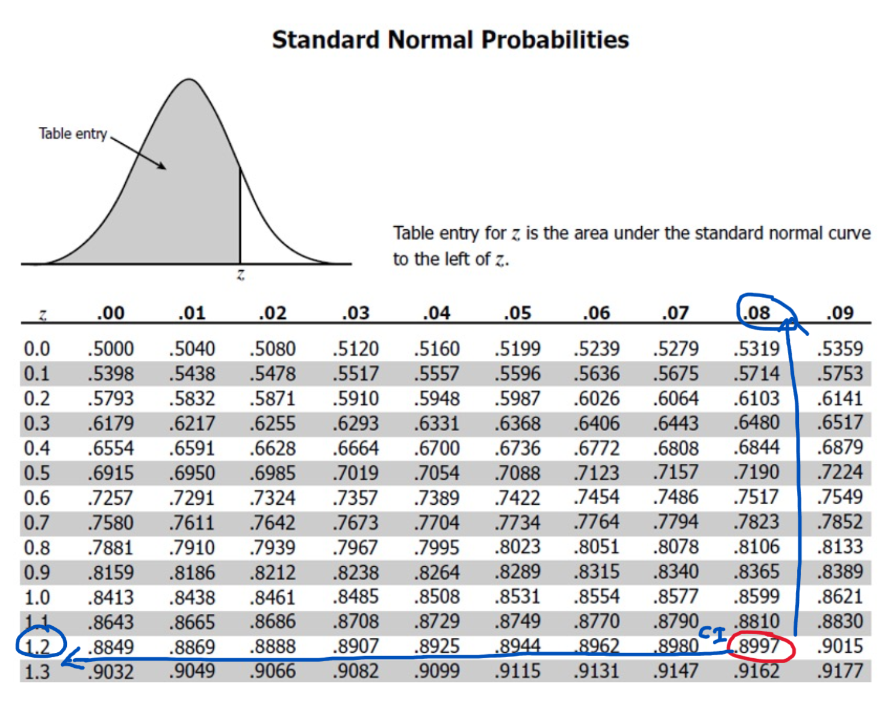
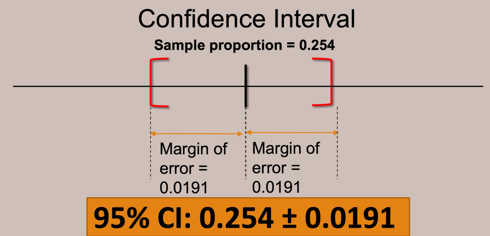
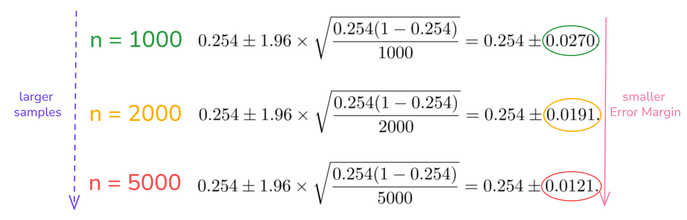

## A. Overview and Learning Objectives
- understand confidence intervals and how it is used to
	- derive an interval estimate
	- understand unknown population parameters (population proportion and mean)

- understand the 4 key steps in hypothesis testing

- apply hypothesis testing in carrying out the chi-squared test and the one-sample t-test
---
## B. Statistical Inference
Important to have well-defined generalisability criteria when conducting sampling $\implies$ is the result of the study representative of the population of the sample?

- sample statistics are subject to inaccuracies (*bias* of researchers / respondents + *random error*)
	- but want to **minimize these inaccuracies** to be as close as possible to *population parameter* $\implies$ which is what we wish to ideally obtain
```python
Sample Statistic = population parameter + bias + random error
```

1. Need to know the **survey methodology** used to generate the sample
2. Need to also know the **statistical methods** used to infer finding(s) from the target population in question.
	1. can statistics from the sample level be generalised / lead to similar conclusions at the population level?

**Methods to reduce bias (recap)**
1. Good Sampling Frame $\to$ zero selection bias
2. Use of probability-based sampling methods $\to$ zero selection bias
3. 100% response rate $\to$ zero non-response bias

> *def:* **Statistical inference** refers to the use of samples to draw **inferences or conclusions** about the population in question.

After EDA is completed, for a given sample, we need to cycle between:
1. Generating Questions
2. Visualization and Analysis of the variables in question
3. Answer Questions and if needed, refine them (fed back into point 1)

#### Advantages of Sample versus Census
1. **Cost:** census requires measurement of every unit in the population 
	1. costly, have a chance of missing out certain groups
	2. very resource intensive

2. **Feasibility:** Instead of taking a small portion for "experiment", require to take everything (i.e. go overboard)
	1. example: Doctor needing to take all of a patient's blood for blood test instead of a small sample

### Rule of Inference
> *def:* The *Fundamental Rule of Inference* states that available data can be used to make inferences about a much larger group if the data can be considered to be representative with regards to the question of interest.

- by adopting good sampling methods and good practices (i.e. having a good sampling frame), we can **greatly reduce selection bias** to be insignificant (i.e. selection bias $\implies$ 0).

- random error refers to the small differences arising as a result of *sample variability* when using any probability-based sampling method.

### Confidence Interval
> *def:* A **confidence interval** is the range of values that is likely to contain a population parameter based on a certain degree of confidence.
- range of values in which the *true mean* may fall within 
- allows sampling variability to be taken into consideration

- degree of confidence is
	- represented as a percentage (%)
	- termed as the confidence level (which is typically 95% or 99%)
	- refers to the long-run reliability of the method used to construct the interval (via repeated sampling)

Focus is on the construction of *confidence intervals* for the **population proportion and mean.**
- we consider `flat_type` variable in the HDB resale dataset $\implies$ indicates the type of HDB resale flat (i.e. 1-room, 2-room ... 5-room, executive, multi-generational)

Formulas:
$$
Raw \: Population\: Proportion_{i} = \frac{Frequency\:(i)}{Total  \: Frequency}
$$

$$
Actual\: Population \: Proportion_i = Raw \: Population\: Proportion_{i} \: \pm \: random \: error
$$
- *Note:* random error could be negative.


#### Confidence Interval Formula
$$
CI = p^* \pm z^* \times \sqrt{\frac{p^*(1-p^*)}{n}}
$$
$p^*$   =   sample proportion
$z^*$   =   z value from standard normal distribution (provides the lower and upper limits)
$n$   =   sample size
The $z^* \times \sqrt{\frac{p^*(1-p^*)}{n}}$ is known as the margin of *error* which impacts the **width** of the confidence interval




**Common Mistake**
Claim that there is a 95% chance that the population proportion of a 5-room resale HDB flat lies between 0.235 and 0.273.
1. Not correct because the **population proportion $p$ is fixed**, does not vary $\implies$ no probabilistic element in what the proportion is going to be
	1. $p$ is either (a) INSIDE the interval or (b) NOT INSIDE the interval
2. For a particular sample, the confidence interval constructed only depends on the sample proportion and the corresponding $z^*$ value and therefore the $CI$ is also "**fixed**" and there is no probabilistic element to it

#### Properties of Confidence Intervals
1. When a sample is taken with *the same sampling frame, sample sampling method (SRS)* but **smaller sample size**
	1. The resultant $CI$ will be **larger** than the one with the larger sample size
	2. Larger sample size = Smaller Random Error (Margin)
	

2. Confidence Level impacts the confidence intervals
	1. i.e. Confidence level of 90% vs 95% affects the $z^*$ value.


### Alternative CI Formula
$$
CI = \bar{x} \pm t^* \: \times \: \frac{s}{\sqrt{n}}
$$


